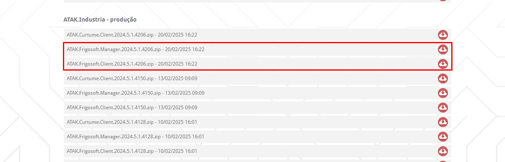
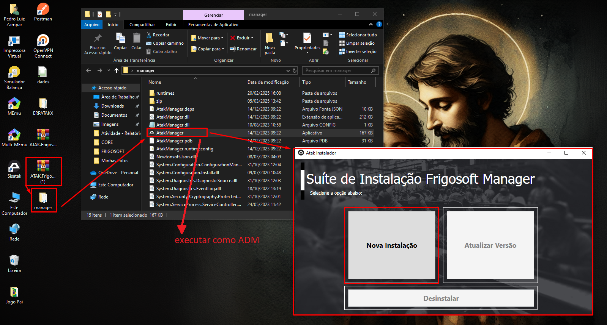
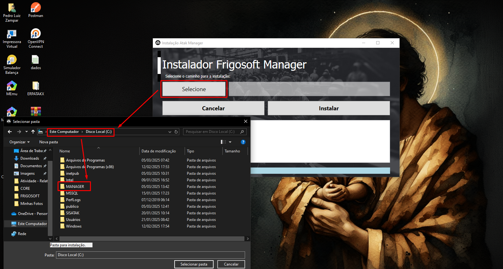
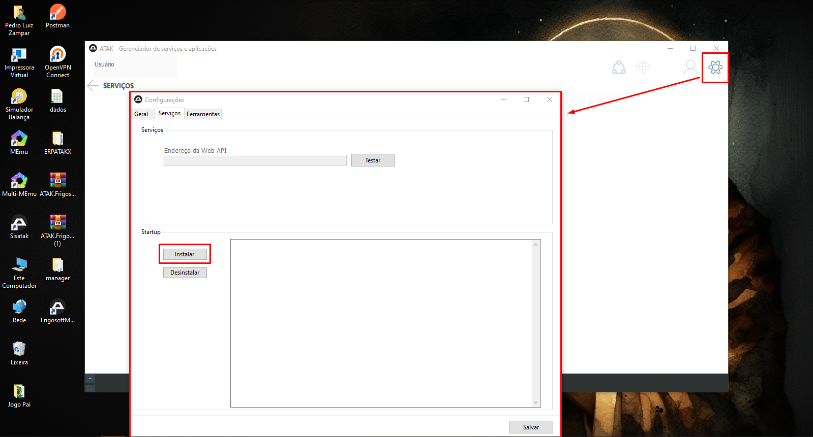
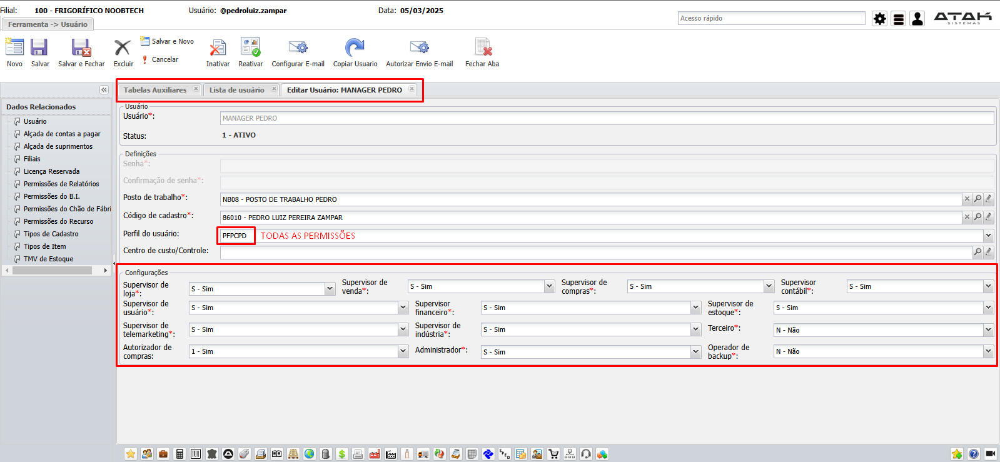
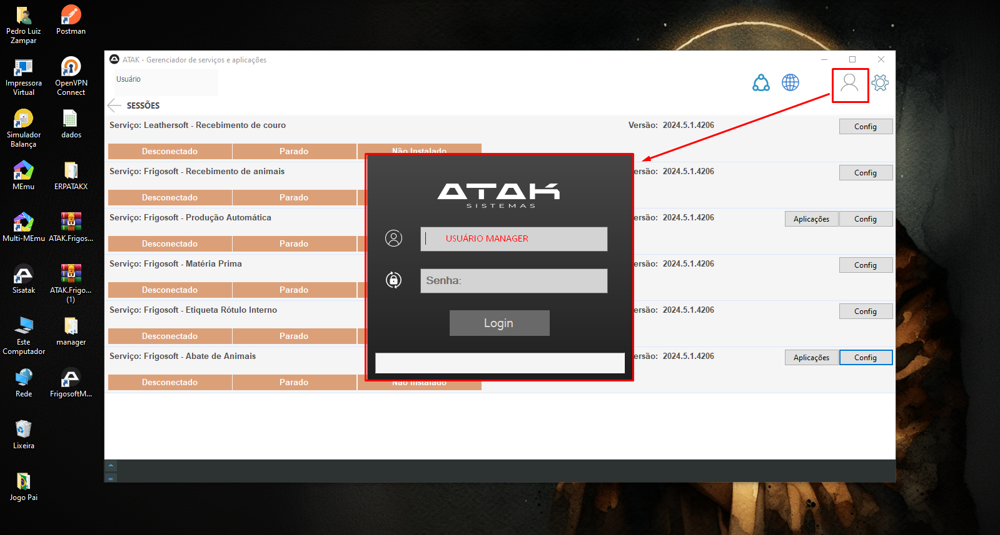
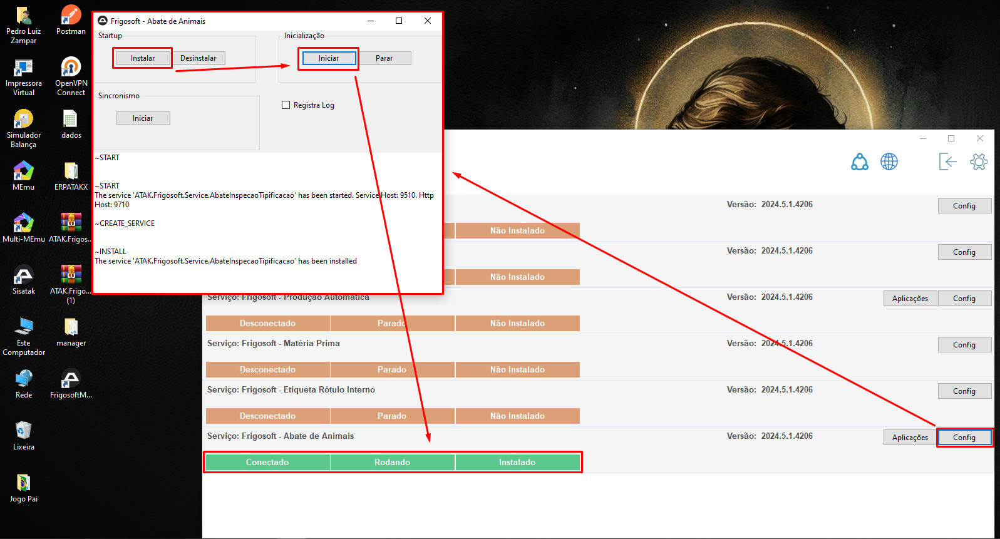
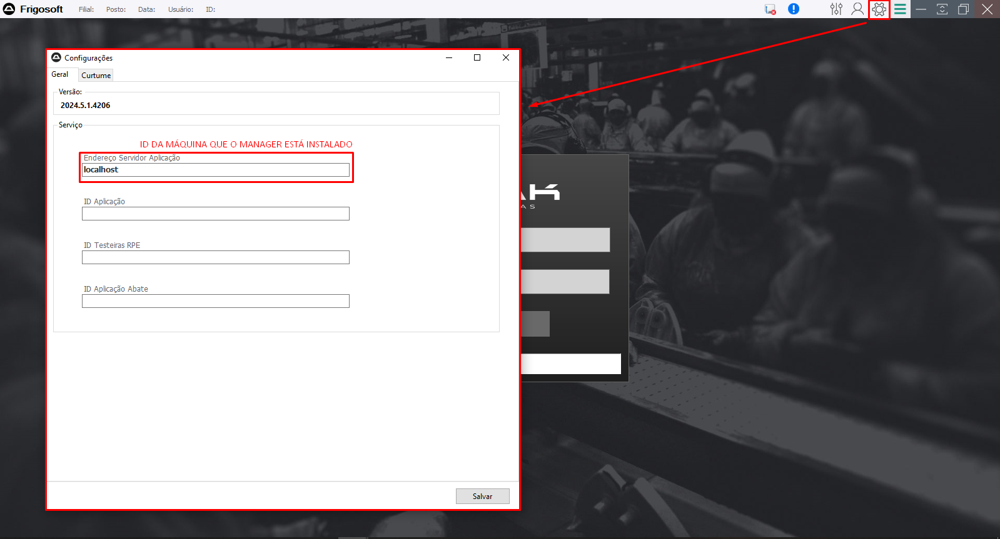

# 📌 **Diário de Bordo 03/03/2025**
## *Treinamento de Instalações do Frigosoft | Instrutor: Rafael Dias e Rafael Garcia*

### Revisão
- #### Atualização da API
    - Download da nova versão da API
    - Remoção do comentário no campo do servidor de licenças e informação do IP do servidor de licenças no arquivo Web.config da pasta nova da API
    - Exclusão de todos os arquivos da pasta original da API com exceção da string de conexão
    - Cópia de todos os arquivos da pasta nova da versão para a pasta oficial

- #### Criação de uma nova API do zero
    - Criação de uma pasta com o nome da API que se deseja criar no caminho `C:\\inetpub`
    - Extrair tudo da pasta API baixada do site de versões e configuração da string de conexão e do arquivo Web.config
    - Criação do aplicativo no IIS informando o caminho da pasta criada
    - Configuração dos pools de aplicativo para o novo aplicativo criado

- #### Atualização do ERP
    - Backup das versões copiando a pasta ERPATAKX e colando em outro local
    - Depois apagamos tudo na pasta ERPATAKX original, menos a pasta CORE
    - Depois abrimos a CORE e deixamos apenas a String de Conexão
    - Depois extraímos os arquivos zip que baixamos no site de versões e mudamos o nome das pastas APP e API (extraímos os arquivos do zip CORE na pasta CORE e extraímos os arquivos do zip portal na raiz da pasta)
    - Por fum, na pasta CORE, corrigimos o campo de Servidor de Licenças no arquivo Web.config

### **Configurando o Frigosoft**

#### Baixar Versões

- ### Manager
    1. Instalando o Manager
        

    2. Criar uma pasta no caminho `C:` com o nome MANAGER e colocar ele como local para instalação
        

    3. Instalando os Serviços
        

    4. Criando um usuário administrador do Manager
        

    5. Acessando o usuário
        

    6. Instalando e iniciando serviços
        

- ### Client
    > Mesmo processo de instalação do Manager

    1. Precisamos informar o IP da máquina onde está instalado o Manager
        