# 📌 **Diário de Bordo 03/03/2025**
## *Treinamento de Instalações do Frigosoft | Instrutor: Rafael Dias e Rafael Garcia*

### **Configurando o Frigosoft**

- ### Criando uma automação
    > ## Aplicações 
    >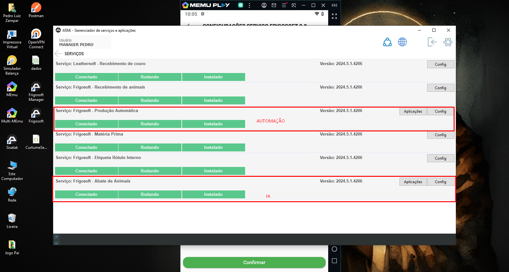

    
    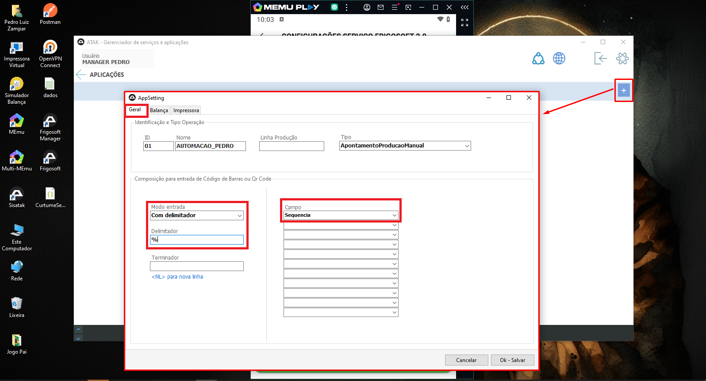
    

- ### Configurando a comunicação entre o Coletor e o Frigosoft Manager
    
    
    
    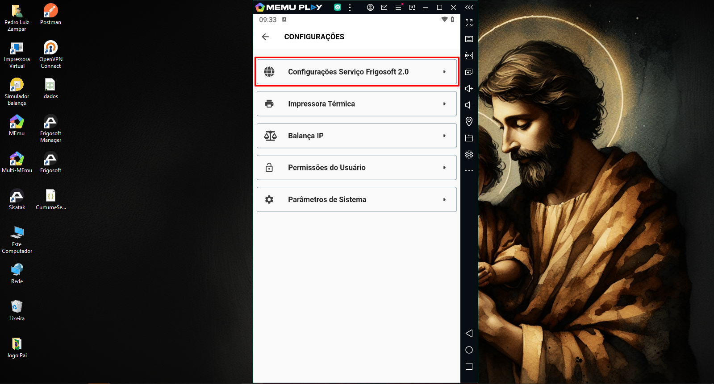
    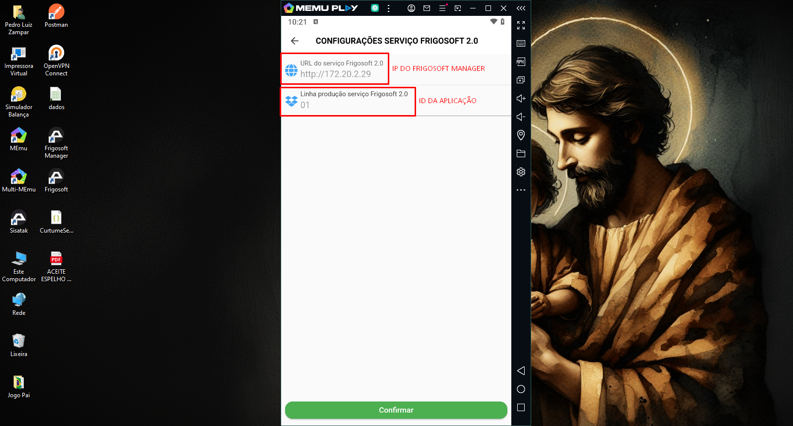

- ### Testando Automação
    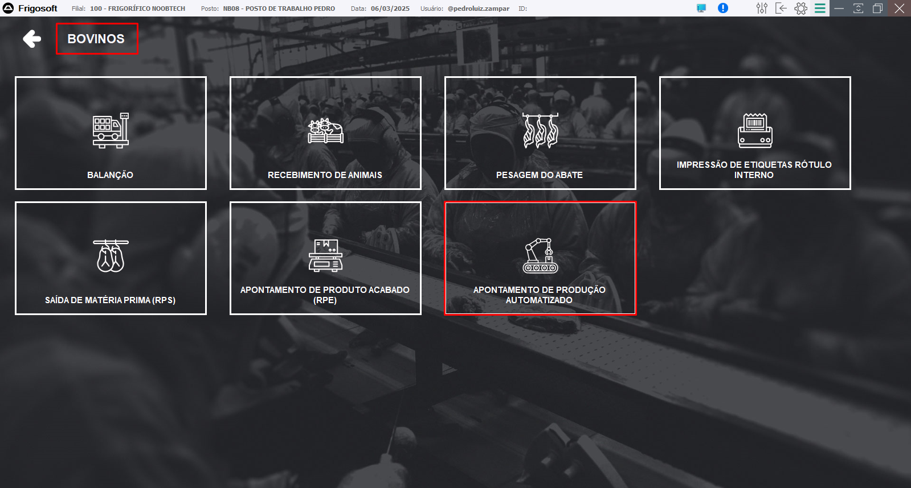
    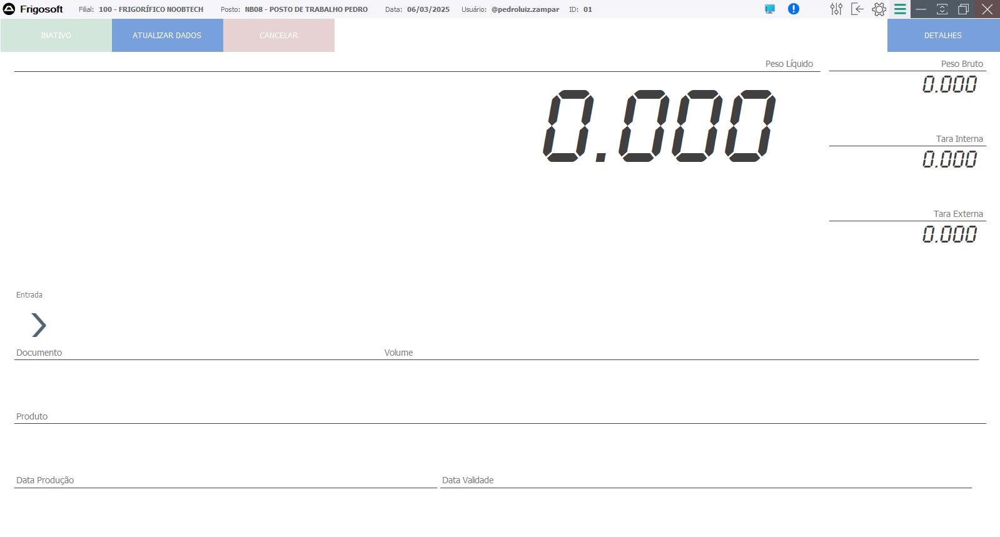

---

### **Desinstalando o Frigosoft**

- ### Manager ou Client
    - Abrimos o instalador e clicamos em desinstalar
    
    - > ### No Manager, precisamos parar e desinstalar todos os serviços

---

### **Atualizando o Frigosoft**

- ### Manager
    1. No caminho `C:\MANAGER\AtakSistemas\bin`, selecionamos todas as pastas e adicionamos para um arquivo compactado e jogamos ele em outro local **(por segurança)**

    2. Depois disso, abrimos o zip com a atualização do Manager e dentro da pasta zip, pegamos o arquivo compacado lá dentro e extraímos ele no caminho `C:\MANAGER\AtakSistemas`

- ### Client
    - Quando é uma atualização de release, não é preciso atualizar o Client (Ele busca a atualização sozinho)

    - Quando é uma atualização de versão, precisamos acessar todos os terminais onde tem um Client instalado
        1. Para atualizar o Client novo, executamos o instalador baixado no site de versões, desinstalamos o Client e instalamos novamente.
        
        2. Depois é só informar o IP do Manager de novo

---

> ## A API comunica informações entre o Manager e o Banco

> ## No Manager informamos a API e no Client informamos o manager: Client -> Manager -> API

---

## Treinamento sobre Balanças - Pedro Miyaki

### Configurando a Balança

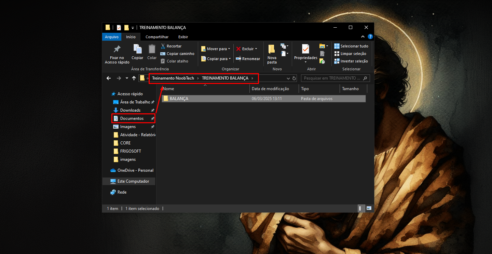
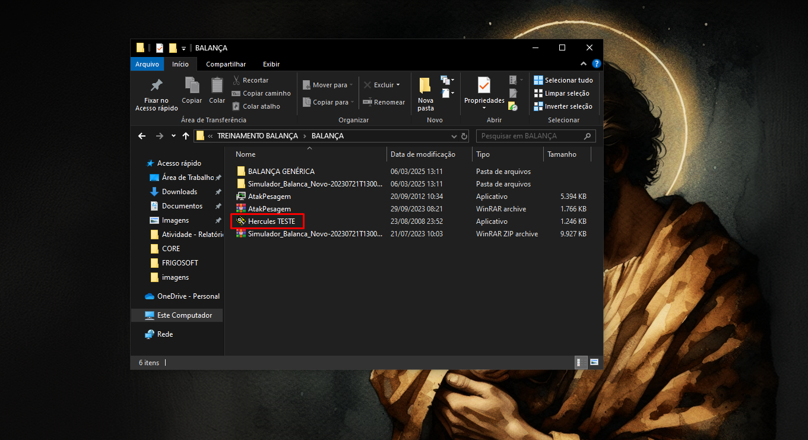
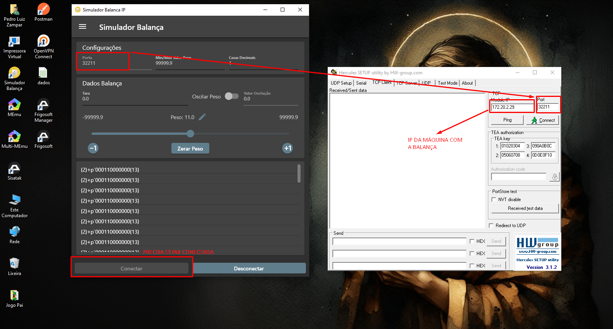
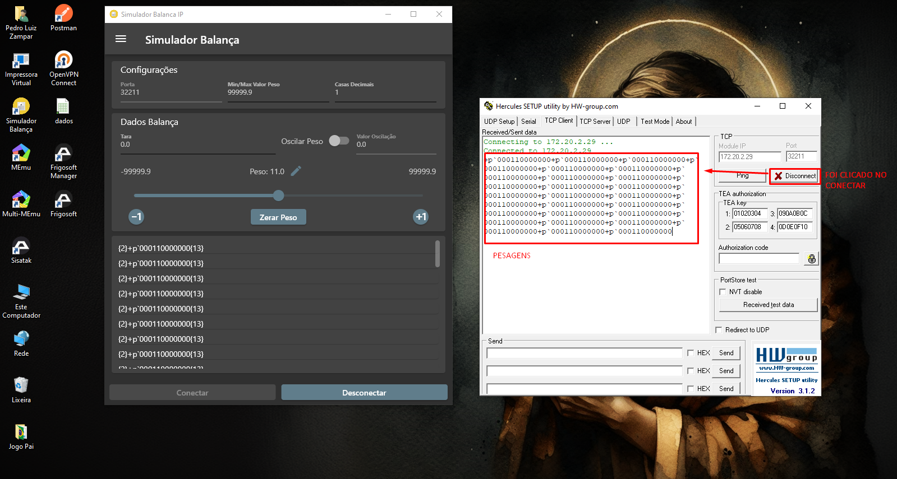
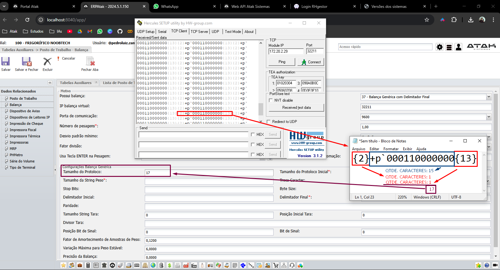
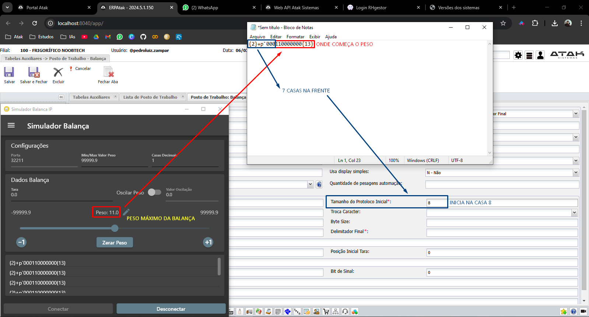
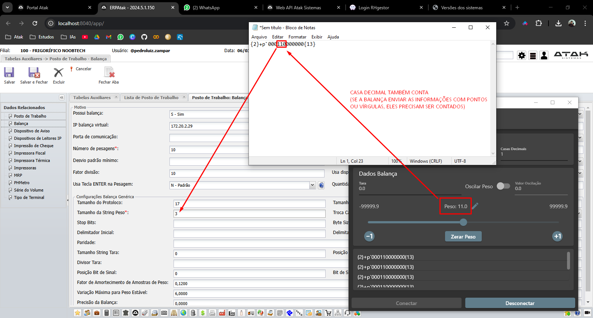
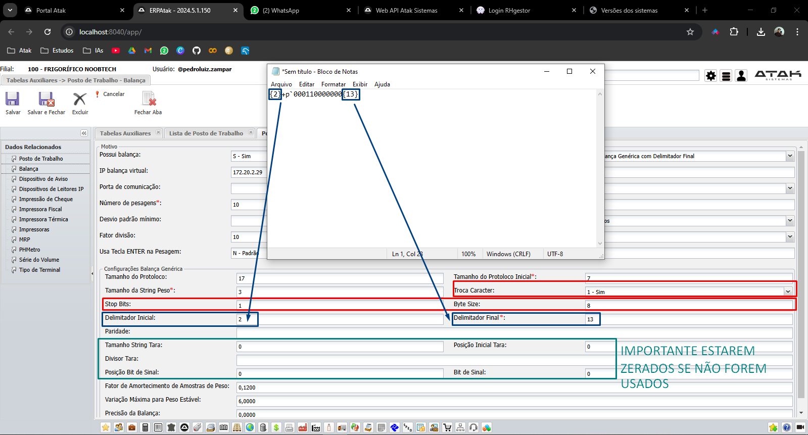

### Balança na Porta COM
> ### Configurações de Balança genérica seguem a mesma lógica da aplicada no exemplo anterior

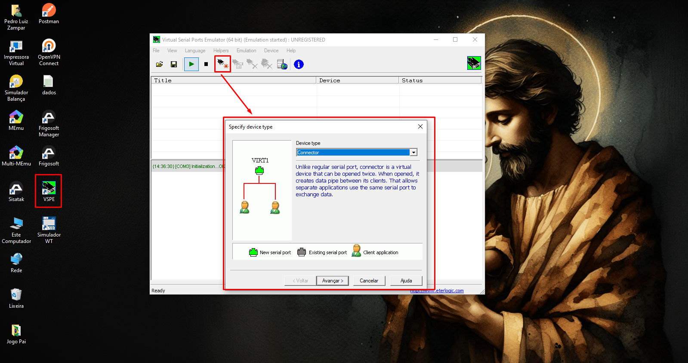
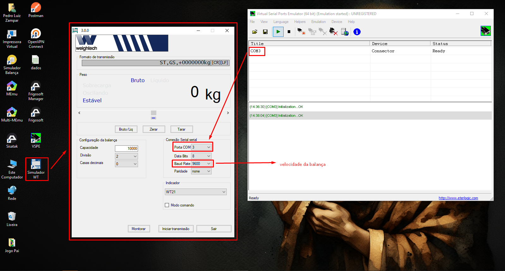
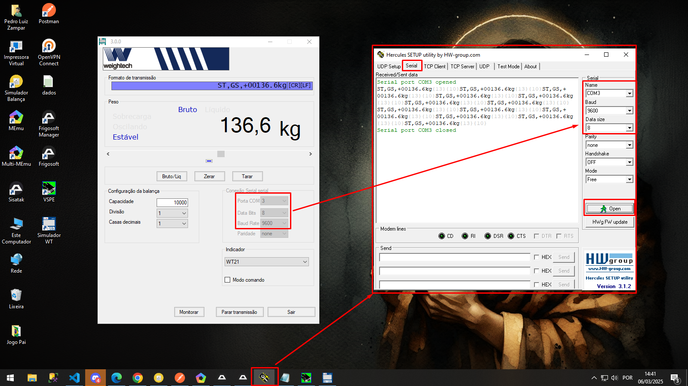

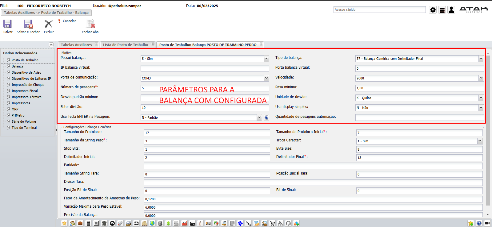