# 📌 **Diário de Bordo 17/03/2025**
## *Treinamento do Frigosoft | Instrutor: Ayad Paracat*

## Rotina de Expedição

### Criação dos pedidos
- #### Criamos um pedido de venda (MOV011 -> TMV T500)
- #### Informamos os produtos que foram produzidos nas rotinas anteriores

### Montagem de Cargas
- #### SisAtak
    
    
    
    
    
    
    

- #### ERP
    
    
    
    
    

### Visualizar Cargas
- #### `Logística -> Monitoramento de Cargas`
    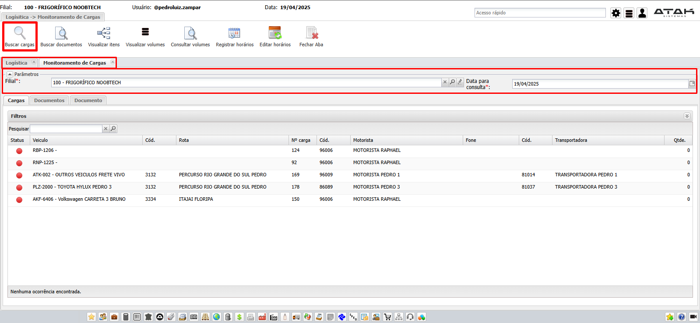
- #### Relaório `Logística -> Relatórios -> WRVDA004 - Ordem de carregamento por carga`
    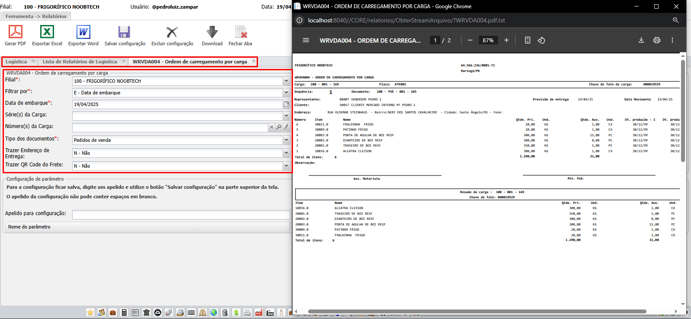

### Expedição por Carga
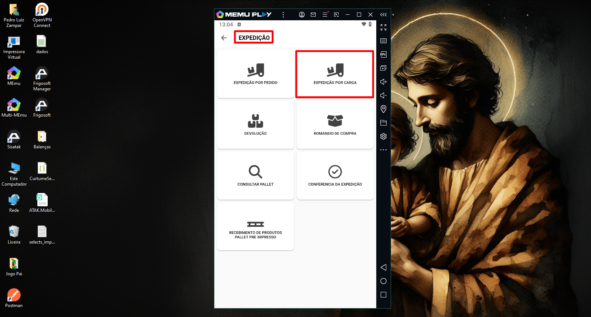
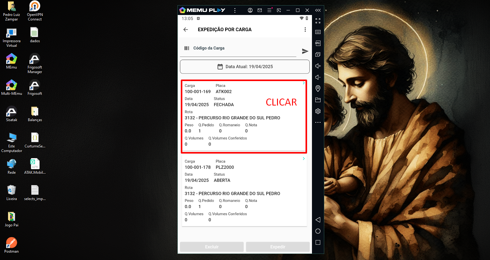
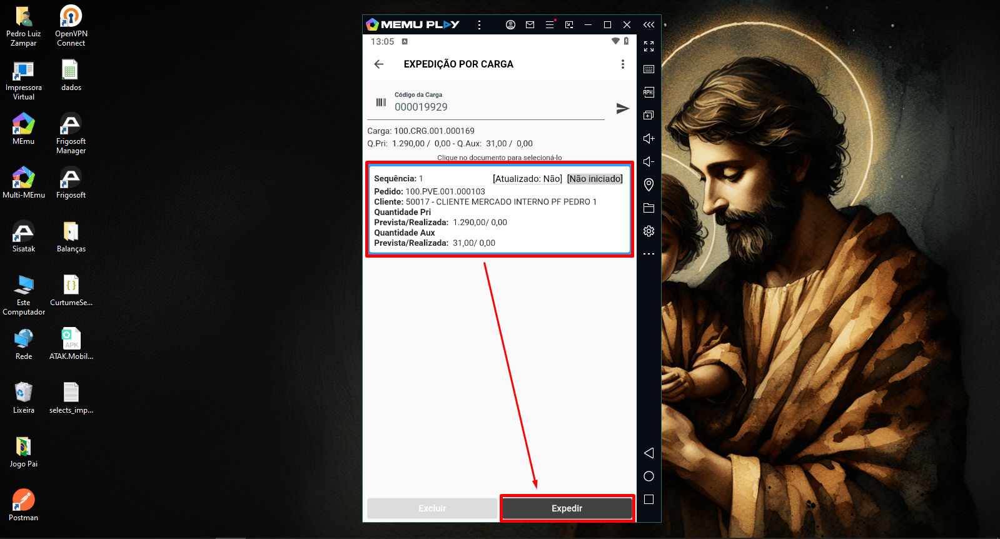
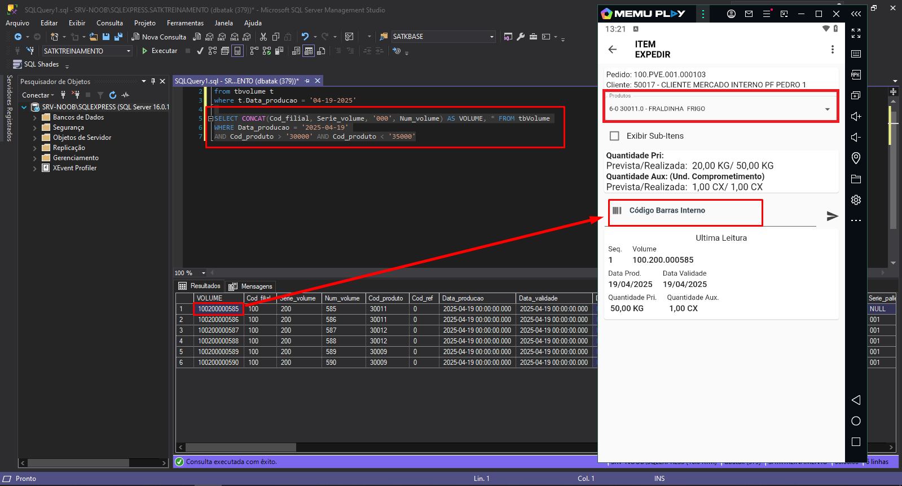
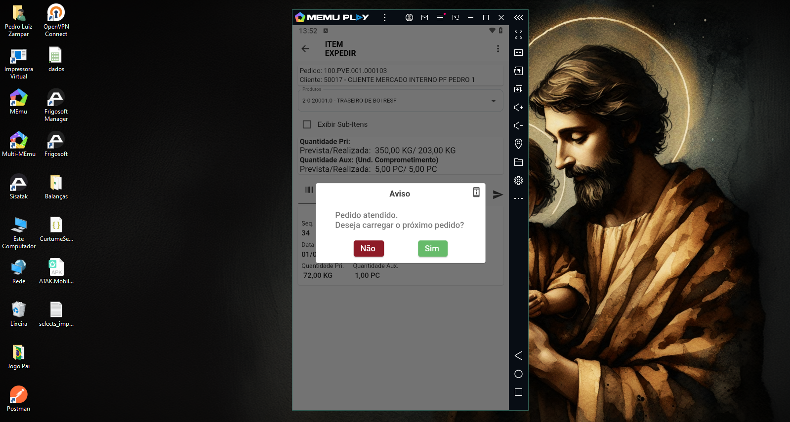
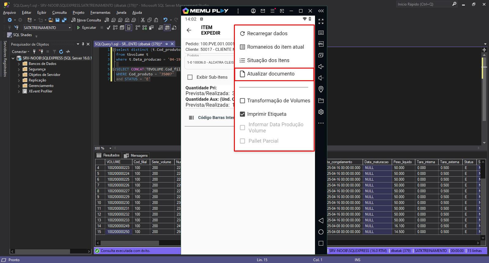

---
---
---
---
---
---
---
---

## Balanção

> ### A principal função do balanção é a comparação do peso inicial e o peso final do caminhão (tanto para a saída quanto para a entrada)

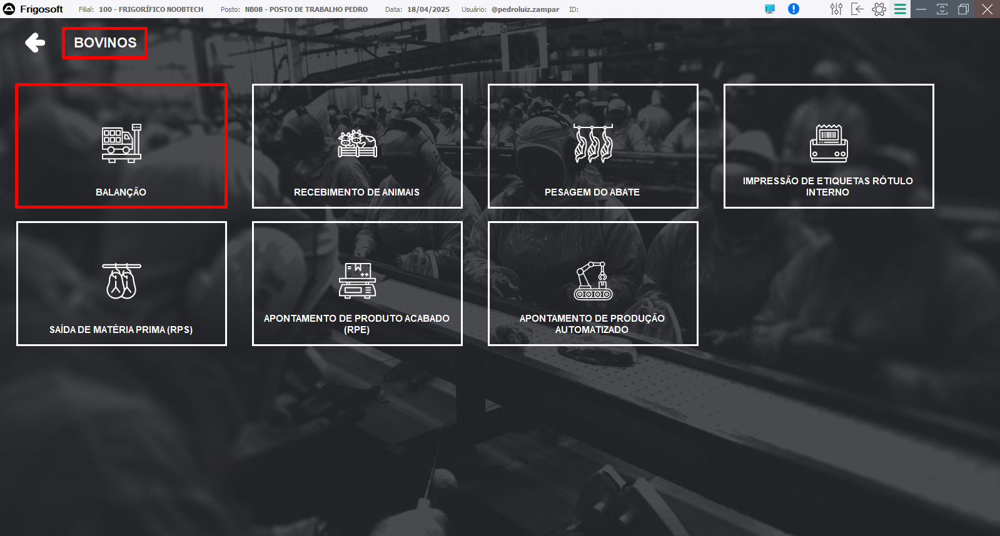
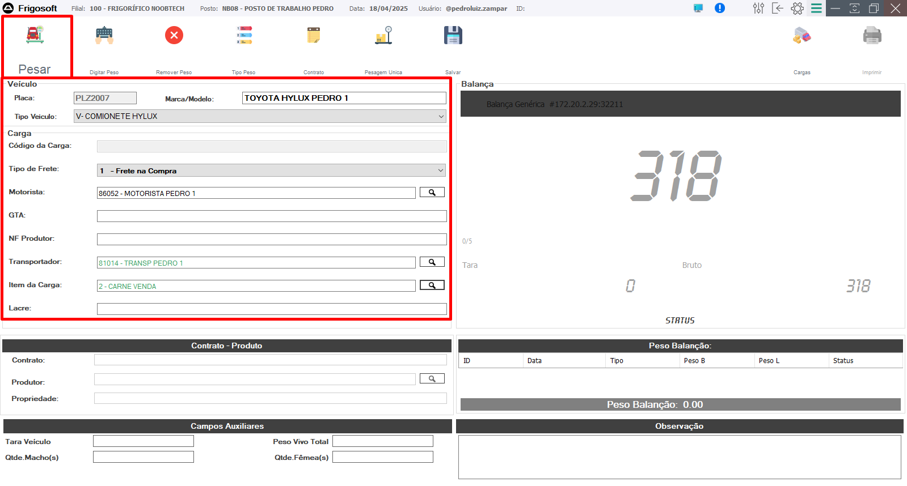
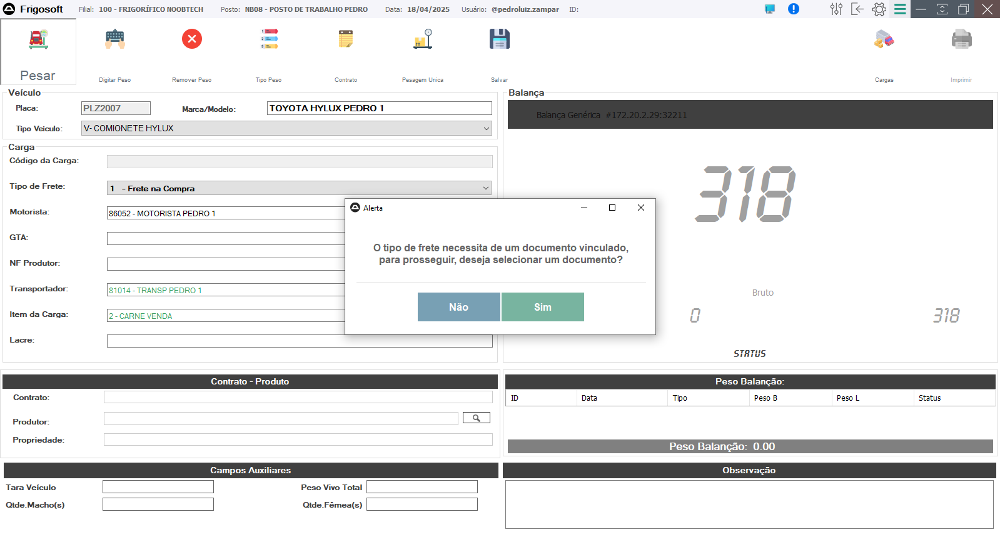
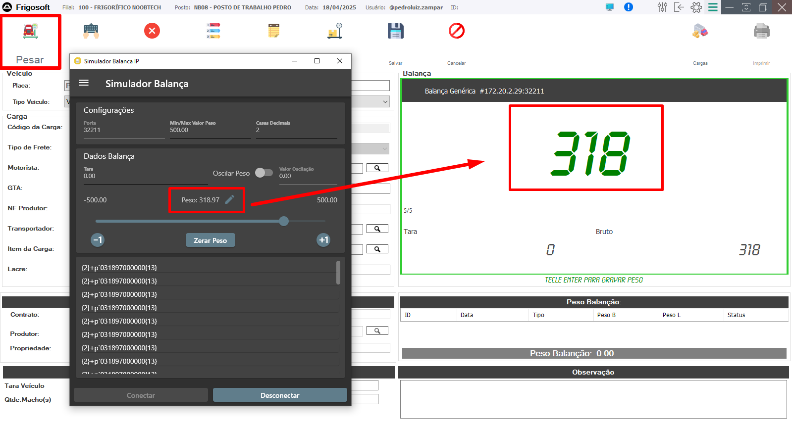
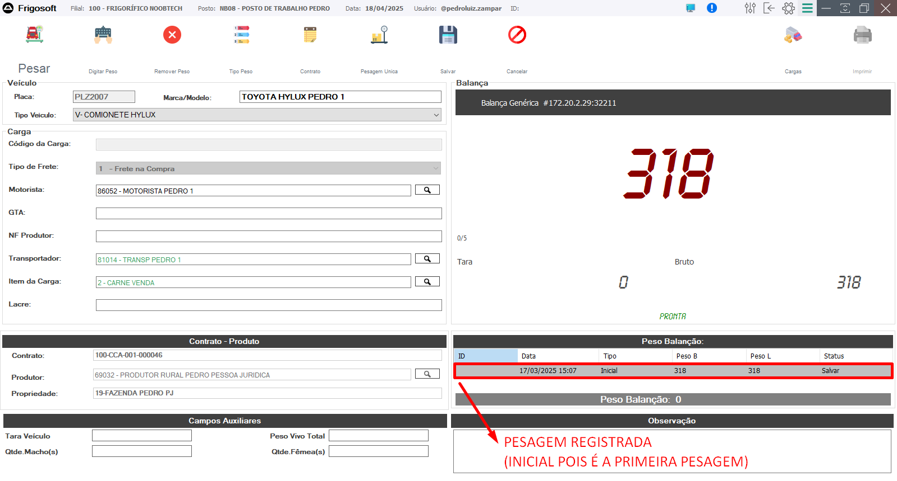
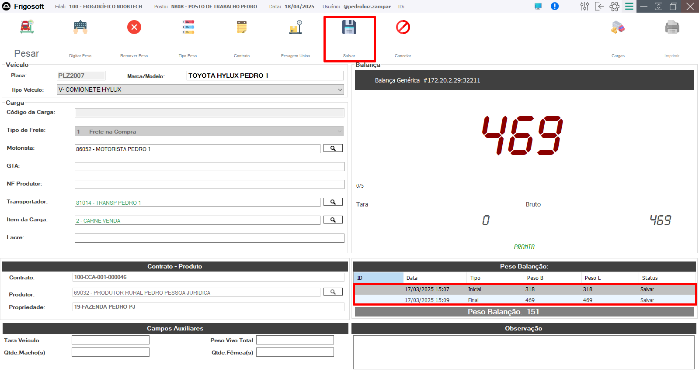
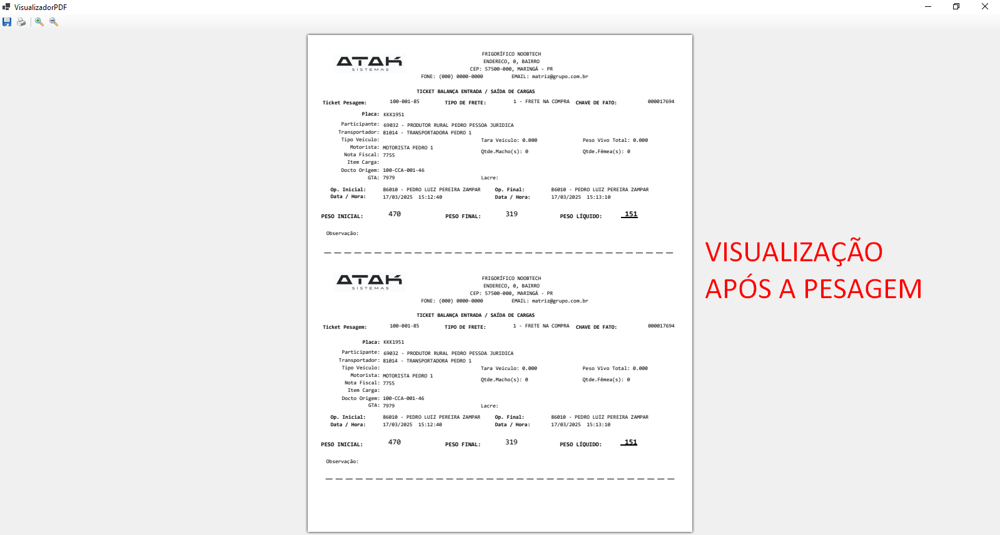