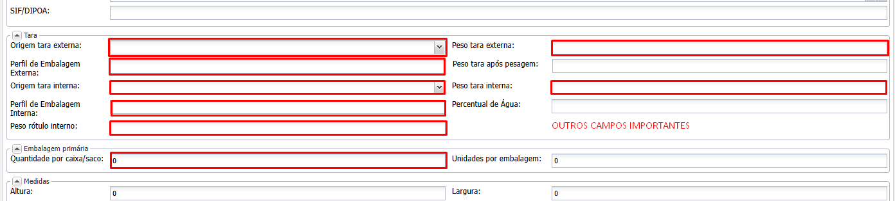
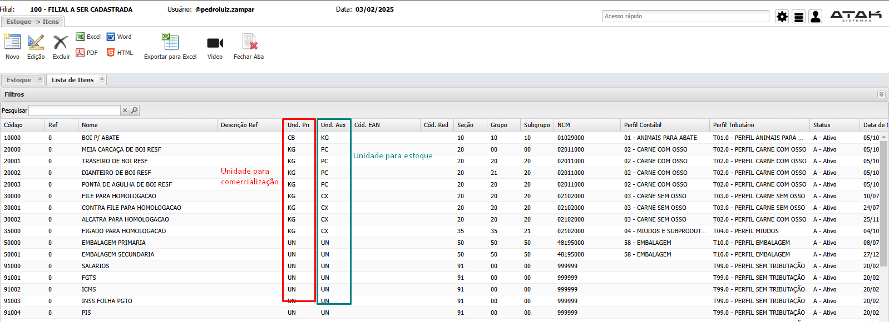
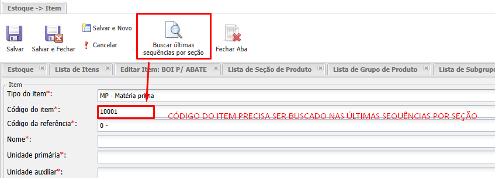

# 📌 **Diário de Bordo 03/02/2025**
## *Treinamento de Cadastros | Instrutor: Rodrigo Amaral*

## Cadastro de Itens
- `Estoque -> Item -> Novo`

- #### Campos obrigatórios (além da página inicial)
    - **Comercial**
        - Unidade de Venda
        - Grupo de comissão (dependendo da regra de negócio do cliente)
        - Aba de Filiais (dependendo da regra de negócio do cliente)

    - **Contábil (Contador do cliente que vai definir esses cadastros)**
        - Perfil Contábil
        - Conta Estoque

    - **Fiscal**
        - Descrição Nota Fiscal
        - Gênero Item SPED
        - Tipo Item SPED (Na aba de Filiais também)
        - Perfil Tributários

    - **PPCP - Programação, Planejamento e Controle da Produção**
        - Unidade de reserva de estoque
        - Forma de identificação do produto nas entradas de estoque
        - Forma de identificação do produto nas saídas de estoque
        - Na aba Características Gerais
            - Exportável
            - Campo Duas pesagens para cada animal (**DEVEMOS CONSIDERAR O TEXTO COMO PESAGEM ÚNICA**)
                > IMPORTANTE PARA A RASTREABILIDADE
        - Na aba Fabricação
            - Código antigo
            - Grupo de rendimento do item da produção
            - Mercado

    - **Suprimentos**
        - Unidade de compra
        - Unidade de venda

    - **Embalagem**
        - Descrição no rótulo
        - Layout de etiqueta interna
        - Layout de etiqueta externa
        - Prazo de Validade
        - Tipo temperatura
        - Temperatura
        
- ### Cadastro de Meia Carcaça
    - `Estoque -> Meia Carcaça`
    - Define quantos novos produtos ele vai gerar (específico para carcaça)

- ### Cadastro de Quartos com Osso
    - `Estoque -> Quartos com Osso`
    - Define quantos cortes terá um produto (quantos novos produtos ele vai gerar)

> #### **Todo produto tem 3 nomes: Nome de cadastro para a busca, nome para nota fiscal e nome para etiqueta**

- #### Tipos de Unidade
    

- #### Tipos de Produtos
    - **Matéria Prima**
        Animais para abate
    - **Produto Acabado**
        - Animal abatido ou processado, miúdos, etc
    - **Produto Revenda**
        - Produto comprado para revenda
    - **Almoxarifado**
        - Tudo que vai ser consumido pela empresa (temperos, facas, etc)
    - **Imobilizado**
        - Itens para o bem ativo da empresa, que agregam bem financeiro (maquinários, celulares, veículos, etc)
    - **Serviços**
        - Serviço de abate, horas técnicas, manutenções, etc
    - **Fórmula (pouco usado)**
    - **Teste de Abate (pouco usado)**
    - **Materiais de consumo**
        - Semelhante ao Almoxarifado
    
- #### Seção, Grupo e Subgrupo
    - Categorização de itens para organização e transparência em relatórios
    - > Essa categorização é definida pelo cliente

- ### Formulação
    - `Estoque -> Formulação -> Novo`
    - #### Serve para informar o custeio de um produto (quanto custa para produzir aquele produto)
    - Informamos os itens consumidos para a produção de outro
        - Ex: Picanha consome -> Caixa, embalagem, fita, etc
