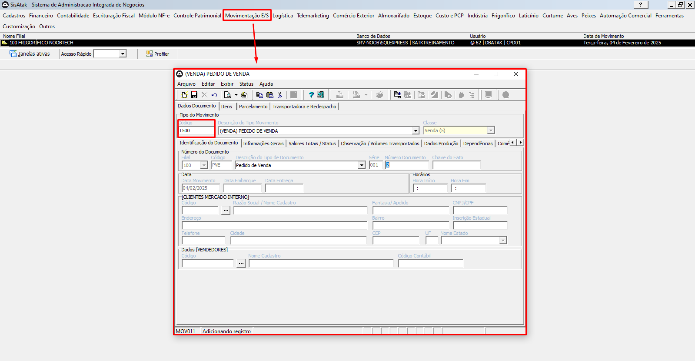
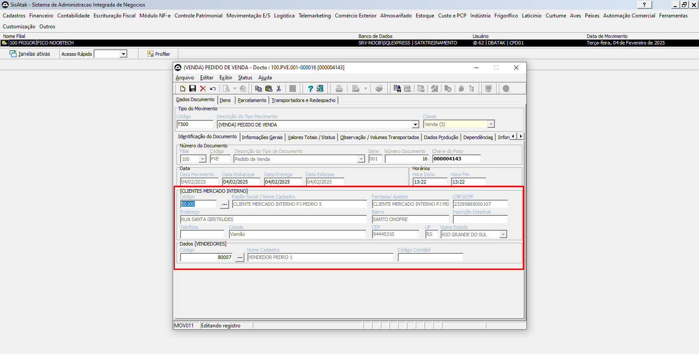
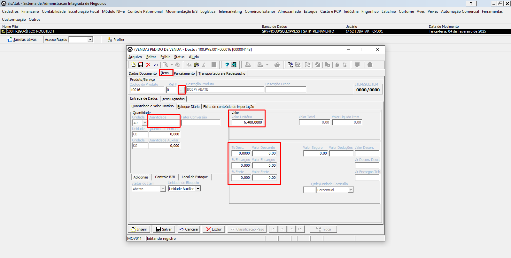

# 📌 **Diário de Bordo 04/02/2025**
## *Treinamento de Cadastros | Instrutor: Rodrigo Amaral*

## Cadastro de Itens

### Imobilizados
- #### Bens que a empresa possui e que pode vender no futuro
- `Estoque -> Item -> Novo`
- Tipo do item: **IM - Imobilizados**
- **Ex: Carros, Caminhões, Computadores, Celulares, etc**

### Serviços
- #### Serviços que a empresa presta
- `Estoque -> Item -> Novo`
- Tipo do item: **SE - Serviços**
- NCM: 00
- **Ex: Transportes, Manutenções, etc**
- > Importante preencher o campo natureza de rendimentos, na aba Fiscal
    

---

## Módulo Comercial

### Lista de Preços
- Define os preços de cada produto
- `Comercial -> Lista de Preço -> Novo`
- #### Adicionando condições de pagamento
    

- #### Configurando preços para cada condição
    

- #### Configurando baseado na qtde. de itens
    
    - > Para isso, precisamos deixar as mesmas condições de pagamento em todas as variações de preço

- #### Lista de Preços Relacionada
    - Usa outra lista como base, podendo ter acréscimos ou descontos baseados em valores ou em precentual para cada produto dessa lista

- > Essas listas usadas são especificadas depois nos TMVs

---

## SisAtak

### O que foi feito
- #### Novo TMV
    

- #### Informando o cliente
    

- #### Adicionando itens
    
    - > após adicionar um item, clicamos em **`Salvar`** no canto inferior esquerdo

- #### Lista de itens adicionados
    