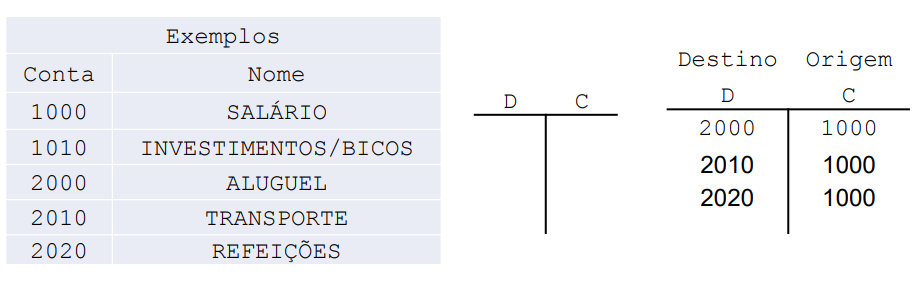
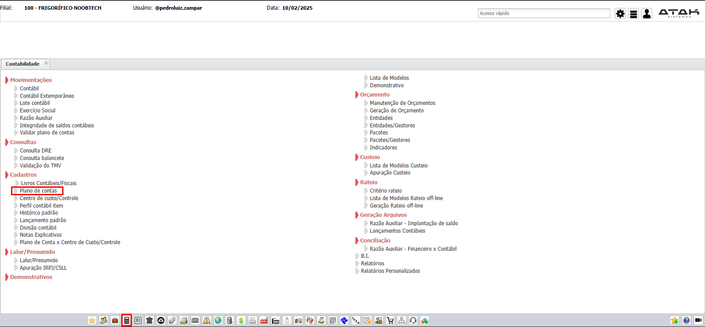
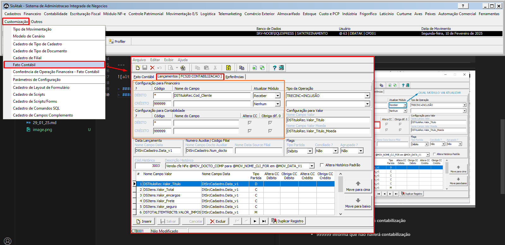

# 📌 **Diário de Bordo 10/02/2025**
## *Treinamento de Cadastros | Instrutor: Rodrigo Amaral*

## Contabilização
###### Registro das movimentações da empresa em contas contábeis

> Existem contas de **Origem** (de onde sai o dinheiro) e de **Destino** (para onde vai o dinheiro), são as chamadas contas de **Crédito** e **Débito** (respectivamente)

> #### - "Se aparecer erro de diferença de crédito, será preciso mexer com contas"
> #### - "Erros de contabilização podem deixar o cliente parado"

### Cadastro de Contas

#### Tipos de conta

- **Sintética**: Conta geral, que agrupa outras contas (como uma seção)

- **Analítica**: Conta mais específica (contas de nível mais alto, por conta dessa especificação)

> ## NÃO É FEITO REGISTRO FINANCEIRO SEM CONTABILIZAÇÃO

---

- #### Em laranja...
    - #### Asterisco (*) informa que terá contabilização
    - #### 999999 informa que não haverá contabilização
    - #### Asterisco (*) com o campo não preenchido indica que o valor será copiado do campo de cima