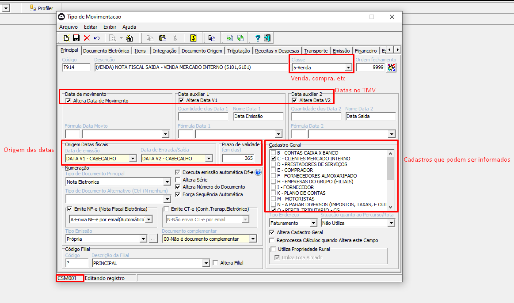
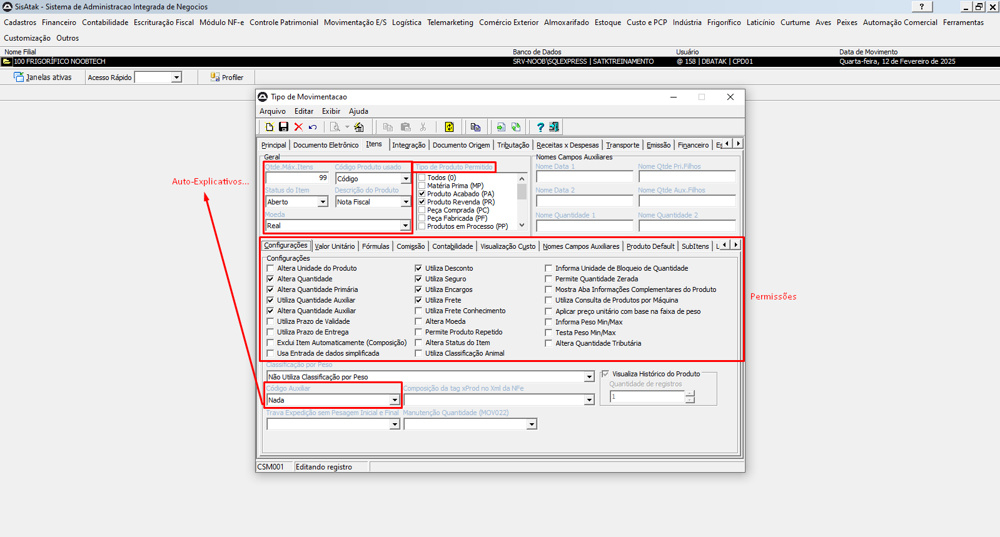
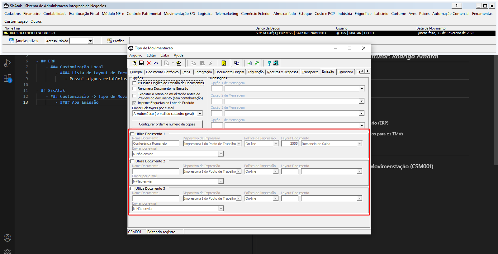

# 📌 **Diário de Bordo 12/02/2025**
## *Treinamento de Cadastros | Instrutor: Rodrigo Amaral*

## Parametrização

- ## ERP
    - ### Customização Local
        - #### Lista de Layout de Formulário (ERP) -> [Uso no SisAtak](#aba-emissão)
            - Possui alguns relatórios para os TMVs e algumas DLLs
        - #### Lista de Parâmetros do Sistema
            - Aqui é possível alterar alguns parâmentros, como:
                - ###### partição de arquivo de SPED
                - ###### tempo de ociosidade de uso do sistema
                - ###### código de documento para a chave fato
                - ###### etc...
        - #### Fato Contábil Fiscal
            - Fato contábil por CFOP da movimentação **(Como as configurações por TMV feitas pelo SisAtak)**
        - #### Gerência de Relatórios
            - Lista de relatórios personalizados feitos para o cliente
        - #### Configuração Safe Trace
            - Integração com um sistema terceiro de rastreabilidade (Safe Trace)
        - #### Lista de Log
            - Lista de Logs de alterações no sistema
        - #### Lista de Log de Navegação
            - Lista de Logs de acesso (Qual tela cada usuário está nesse momento)
        - #### Manutenção do Tipo de Cadastro
            - ###### Definição de sequência atual
            - ###### sequência mínima
            - ###### sequência máxima
            - ###### etc...
        - #### Manutenção do Tipo de Movimento
            - ###### Definição da forma de pagamento/recebimento
            - ###### carteira de cobrança
            - ###### se envia e-mail ou não
            - ###### etc...
        - #### Recursos do sistema
            - Lista as funcionalidades do sistema
        - #### Serviços do sistema
            - Aqui ficam os serviços de relatório e de SPED
        - #### Eventos de Integração
            - Integrações dentro do sistema (processos finalizados ou não. Ex: Inventário)
        - #### Monitoramento Distribuição DFe
            -  Notas emitidas contra o CNPJ da empresa. É possível dar ciência ou desconhecimento da nota pelo sistema
        - #### Monitoramento do Agendador
            - Geração de arquivos de remessa para corrigir negativação de cliente no serasa, por exemplo. **(Aqui se ativa o serviço para realização da rotina configurada em `Customização -> Agendamentos`)**
        - #### Painel de Conexões
            - Monitora todas as conexões ativas no sistema, configura elas e permite derrubar outras conexões
        - #### Painel de Contingência
            - Informamos outro servidor para quando o servidor titular para emissão de notas estiver fora do ar

    - ### Customização
        - #### Agendamentos
            - Agenda envio de avisos, lembretes de cobrança, etc
        - #### Bloquear recursos
            - Nessa tela, bloqueamos recursos para todos os usuários do sistema (exceto os usuários @), independente de permissões
        - #### Campos Customizáveis
            - Criação de novos campos em uma entidade (Ex: Cadastro geral), podendo definí-los como obrigatórios ou não e o seu tipo (texto, data, etc)
        - #### SQL Tipo de Movimento -> [Uso no SisAtak](#cadastro-de-comandos-sql-csm008)
            - Cadastro de scripts SQL para realizar algumas ações no banco de dados
        - #### Tipo de Cadastro
            - Cadastro de novos tipos de cadastro ou edição dos já existentes
        - #### Tipo de Movimento
            - Cadastro de novos tipos de movimento ou edição dos já existentes
        - #### Tipo de Item
            - Edição de tipos de item já existentes
        - #### Histórico de alterações
            - Versões do sistema e suas funcionalidades
        - #### Integração do Faturamento de Franquias
            - Relacionado com o frente de loja
        - #### Liberação de Relatórios Personalizados
            - Usuário do coordenador aprova por essa tela os relatórios personalizados criados
        - #### Web Config
            - Cadastro de integração 
        - #### Cadastro Geral
            - Parâmetros sobre os cadastros gerais (Como tipo de cadastro válido)
        - #### Comercial
            - Parâmetros sobre o módulo comercial
        - #### Contabilidade
            - Parâmetros sobre o módulo contábil
        - #### Controle Patrimonial
        - #### Documentos Eletrônicos
        - #### Movimentação E/S
        - #### Suprimentos

- ## SisAtak
    - ### Customização
        
        
        
        - #### Tipo de Movimentação (CSM001)
            - ##### Aba Emissão
                - ###### Informamos os documentos que poderão ser impressos nesse TMV
                
        - #### Cadastro de Comandos SQL (CSM008)
            - ##### Cadastro de scripts SQL para realizar algumas ações no banco de dados