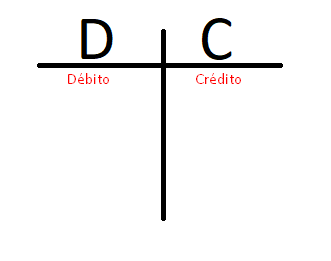
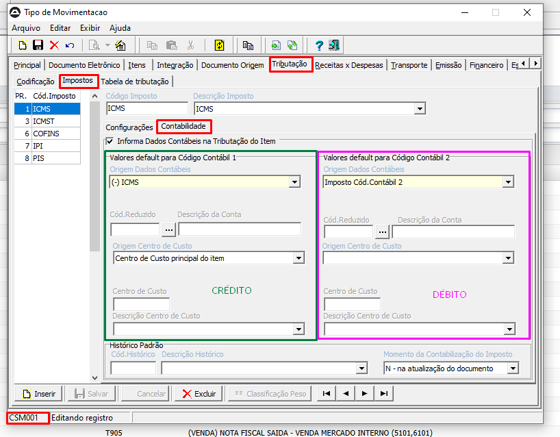
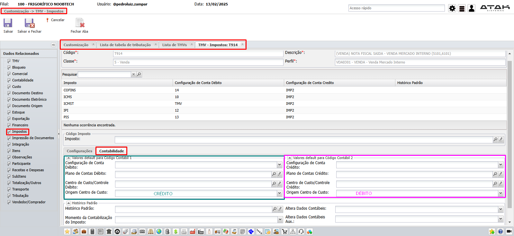

# 📌 **Diário de Bordo 13/02/2025**
## *Treinamento de Cadastros | Instrutor: Rodrigo Amaral*

> ## **Contabilidade de impostos**   
> 
# INVERTI O LADO PARA CRÉDITO E DÉBITO NAS 2 IMAGENS ABAIXO. IMAGEM DE CIMA ESTÁ CORRETA (DÉBITO X CRÉDITO)
> - ### SisAtak
>   
> - ### ERP
>   

## Parametrização

- ## SisAtak
    - ### Tipo de Movimentação
        - > Principais abas que mexemos para parametrizar um TMV:
            - Principal
            - Itens
            - Receitas x Despesas
            - Financeiro
            - Estoque
        - Acessamos todas as abas, uma por uma, detalhando cada funcionalidade

-------

## Aulas RH Gestor

- ### Performance

    
    

- ### SQL Profiler

    

- ### Índices

    
    
    
    
    

- ### Plano de Consultas

    
    
    
    
    
    
    
    
    