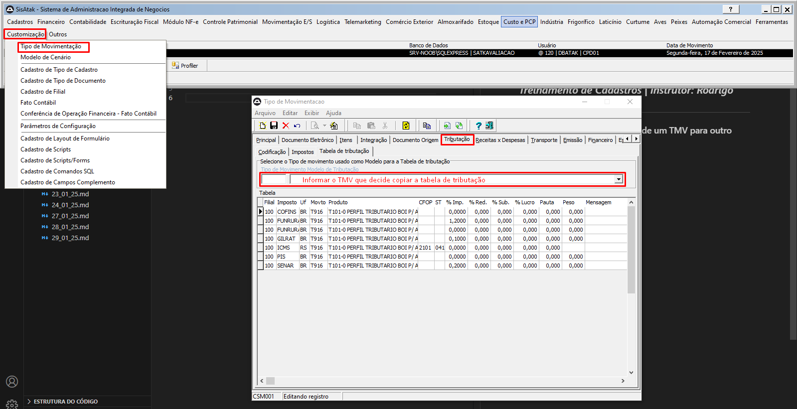

# 📌 **Diário de Bordo 17/02/2025**
## *Treinamento de Cadastros | Instrutor: Rodrigo Amaral*

### Copiando tabela de tributação de um TMV para outro

### Atividades

- Revisão dos conteúdos para a prova
- Prova teórica sobre Tributações, Contabilizações e Escrita Fiscal
- Prova prática sobre cadastro de tabelas de tributação

## Notas

- **Centro de custo controle**: Cadastro dos setores, vinculando os gastos;
- **Criação de conta contábil**: Módulo Contabilidade -> Cadastros -> Plano de Contas (esses planos vêm padronizados no sistema, porém é possível cadastrar de acordo com a necessidade do cliente);
- **Perfil contábil item**: Reúne várias informações de cadastro para que, na movimentação deles, fiquem no fato contábil (onde ele busca as informações);
- **Escrita fiscal**:  
    - **Tabela CFOP**: São as tabelas que informam venda ou compra de acordo com a natureza da operação;
    - **ST – Situação Tributária (ICMS)**: Esse campo precisa ser preenchido corretamente, pois, ao informar o código, ele precisa estar de acordo com o cadastro do imposto.  
    Exemplo: Se o produto é isento de tributação e foi informado o código "não tributável", o sistema ignorará as informações preenchidas referentes aos impostos.
- ### Informações básicas do TMV:
    - Gera estoque?
    - Gera financeiro?
    - Gera contabilização?