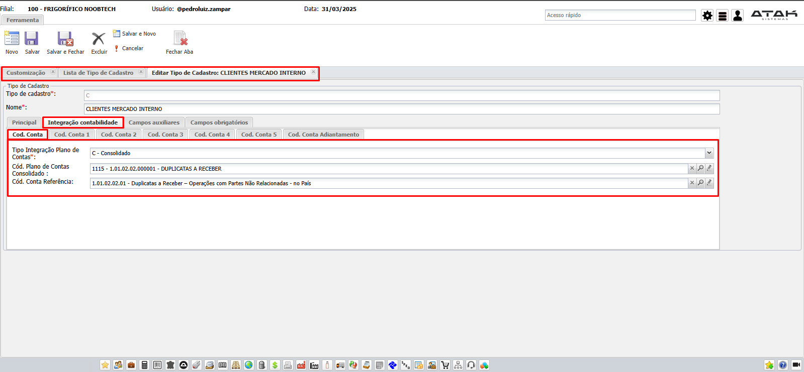
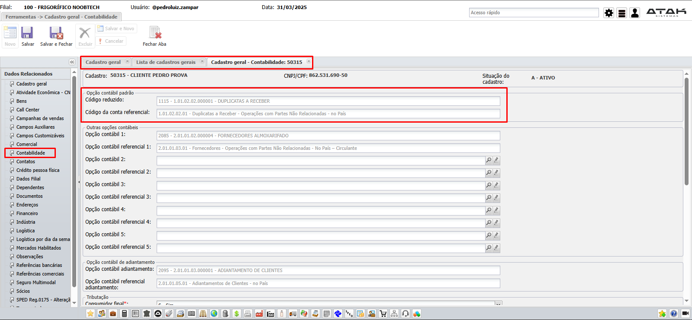
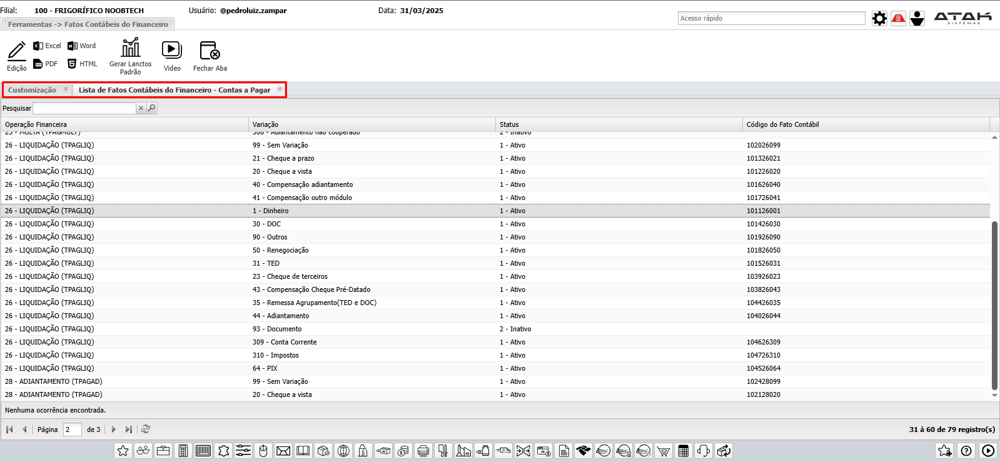
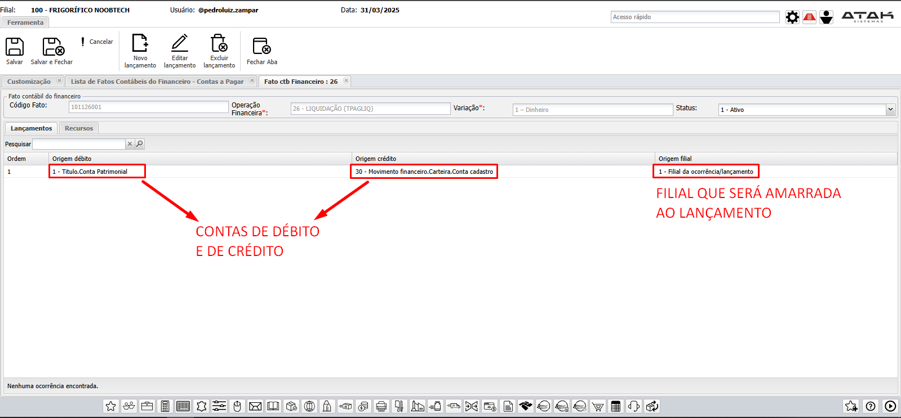

# 📌 **Diário de Bordo 31/03/2025**
## *Treinamento Financeiro | Instrutora: Elisandra Guioti*

## Configurações

- ### `Customização -> Financeiro`
    - Configurações de contas contábeis
    - Parâmetros de permissões

- ### `Customização -> Tipo de Cadastro`
    - Contas configuradas
        
        

- ### `Customização -> Fato Contábil Contas a Pagar` | `Customização -> Fato Contábil Contas a Receber`
    
    

- ### `Financeiro -> Carteira`

- ### `Financeiro -> Condição de Pagamento`

---

## Liquidando Títulos

- ### `Financeiro -> Liquidação Manual`

---

## Tabelas Importantes

- `tbTituloRec`
- `tbTituloPag`
- `tbMovtoFin`
- `tbMovtoCtb`

> ### Não se fazem lançamentos manuais! (É possível apenas acessando `Financeiro -> Saldo Inicial`, mas essa não é uma forma que está na rotina dos clientes)