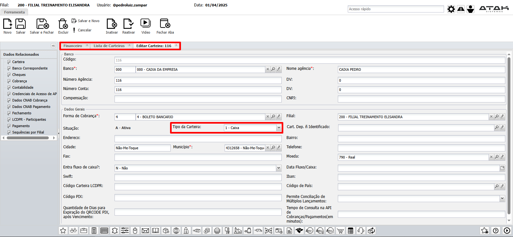
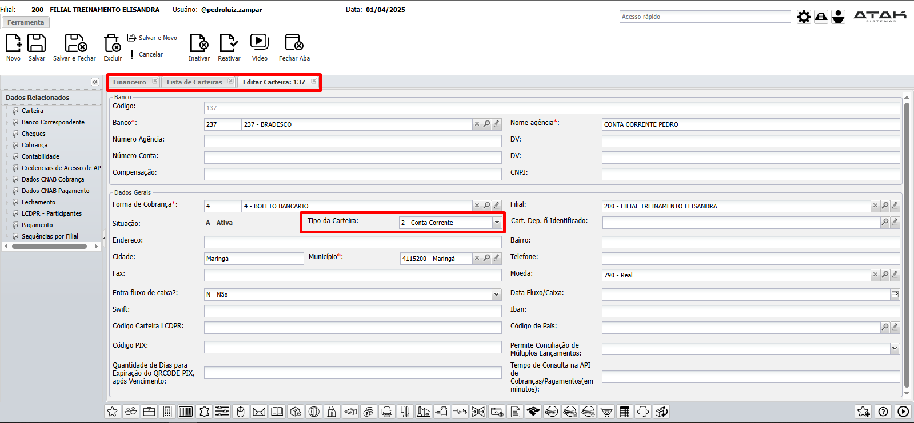
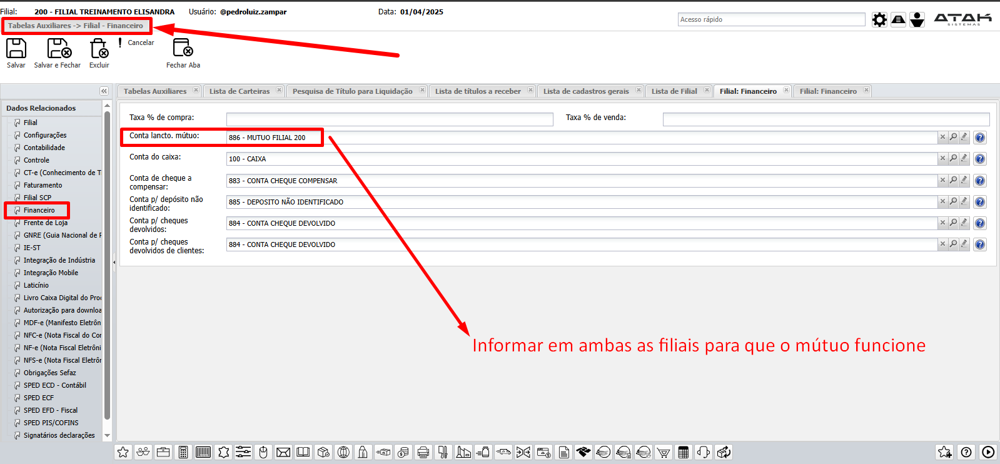

# 📌 **Diário de Bordo 01/04/2025**
## *Treinamento Financeiro | Instrutora: Elisandra Guioti*

> #### CodReduzContaPat -> Código da conta patrimonial do participante da operação financeira
> 

## Atividades do dia

- #### Cobrança (`Financeiro -> Seção Cobrança`)
    - Acréscimo
    - Descréscimo
    - Juros
    - Desconto
    - Multa (`Seção Liquidação ->  Multa`)
    - Etc...

    > ### Alterações nessas informações não aparecem no extrato, pois não alteram a carteira, apenas o título

- #### Liquidação com Mútuo

    > ### Quando estou fazendo uma operação com carteira do tipo **CONTA CORRENTE (banco)**, as rotinas verificam a **FILIAL DA CARTEIRA** com a **FILIAL DO TÍTULO**. Caso sejam diferentes, gera o título mútuo.
    > 

    > ### Carteira do tipo **CAIXA** olha a **FILIAL LOGADA** com a FILIAL DO TÍTULO.  Caso sejam diferentes, gera o título mútuo.
    > 

    

- #### Cheque com Mútuo

- #### Importação de títulos financeiros (`Financeiro -> Saldo Inicial`)
    - #### [Arquivo de Importação de Títulos](../documentos/ATAK_Planilha_modelo_ImportacaoTitulos_Contas_a_Receber.xlsx)

- #### Adiantamento de Cliente (`Financeiro -> Adiantamento de Cliente`)
- #### Adiantamento de Fornecedor (`Financeiro -> Adiantamento de Fornecedor`)

- #### 2° Via de Boleto

- #### Arquivo de Remessa

- ### Transferência entre Contas