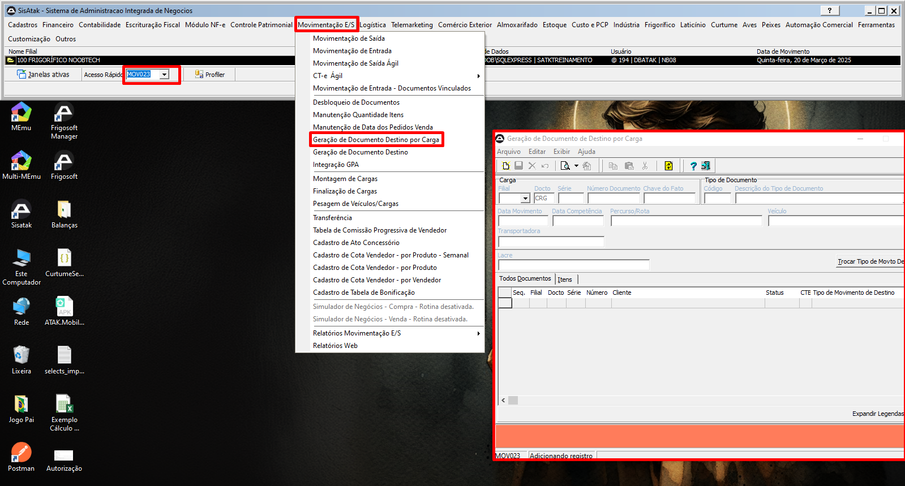
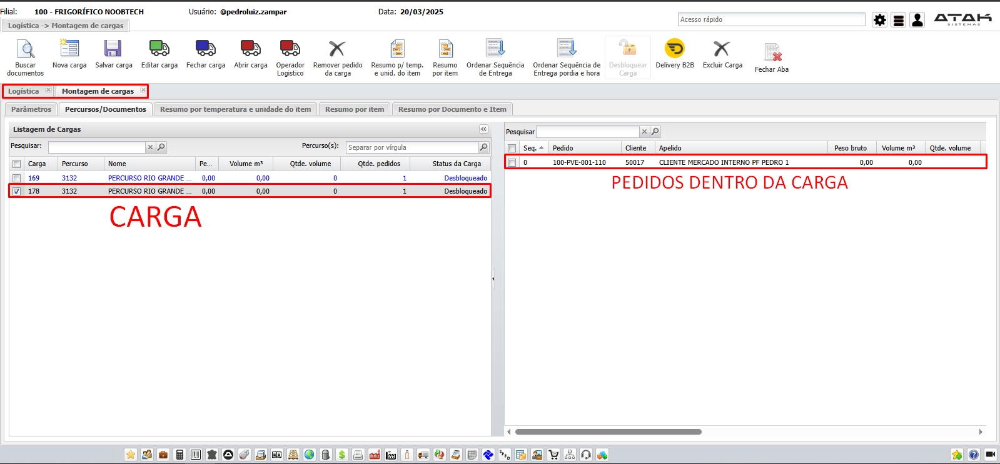
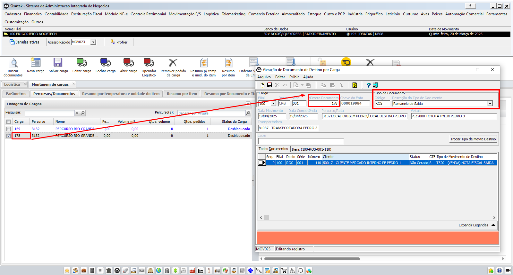
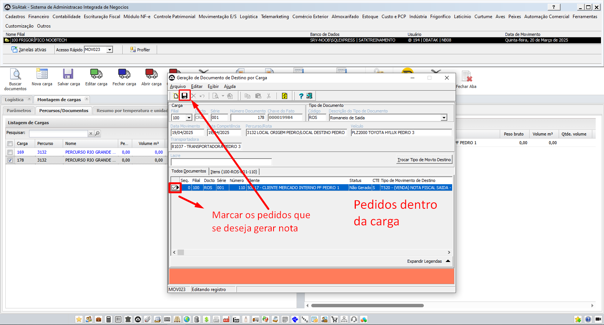

# 📌 **Diário de Bordo 20/03/2025**
## *Treinamento Fiscal | Instrutor: Luiz Otávio*

## O que foi feito no dia

- #### Customização de TMVs
- #### Criação de TMV a partir de outro
- #### Cadastro de comissão Produto x Vendedor | `Comercial -> Grupo de Comissão de Produto e Vendedor`

    
    
    

    > ### CLIENTE JÁ PRECISA TER UM VENDEDOR VINCULADO

    - *Vinculado no Cadastro do Produto*

        
        

    - *Configurando Comissão no TMV*
        

- #### Pedido de Venda (T500)
- #### Romaneio de Venda (T510)
- #### Nota de Saída (T520)

### Gerando notas automáticas para vários romaneios dentro de uma carga

> ## ROMANEIO NÃO MOVIMENTA CONTÁBIL!!!