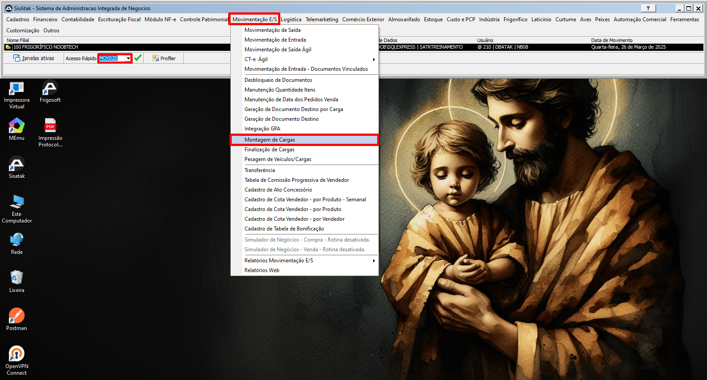

# 📌 **Diário de Bordo 25/03/2025**
## *Treinamento Fiscal | Instrutor: Luiz Otávio*

### **Processo de Nota de Devolução de Cliente**

- ### Processo Manual (EXCEÇÕES E CASOS DE EMERGÊNCIA)

    1. #### Autorização de Devolução (MOV012 | T580)

    2. #### Romaneio de Devolução (MOV012 | T581)

    3. #### Nota de Devolução (MOV012 | T582)

- ### Processo pela Indústria (PROCESSO PADRÃO)

    1. #### Autorização de Devolução (MOV012 | T580)

    2. #### Romaneio de Devolução (IND049 | T581)
        > ##### O ideal é que os itens sejam bipados pelo volume (`Cadastro do Item -> aba PPCP -> Campo: Forma de identificação do produto nas entradas de estoque -> Valor: INT - Cod. Barras Interno`)

    3. #### Nota de Devolução (MOV012 | T582)

---

### Acompanhamento do processo de geração de um MDF-e

> ## Códigos para cada documento
> ### NE -> 55
> ### CTE -> 57
> ### MDF-e -> 58

> #### Quando a carga é da empresa e também o transporte, o campo Tipo do Emitente é: "Transportador Carga Própria" e o Tipo de Transportador é em branco

> #### Quando o emitente da carga é um prestador de serviços (terceiro), o tipo de transportador será ETC (Empresa de Transporte de Cargas)

