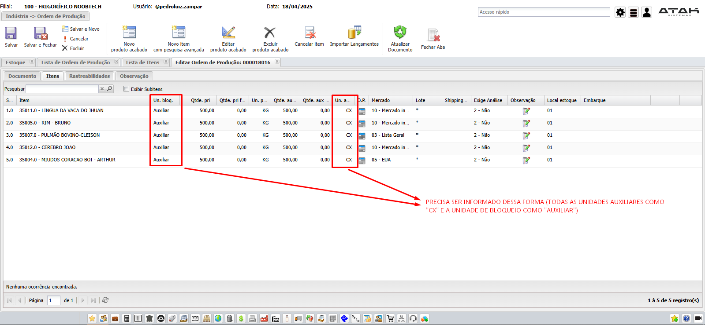

# 📌 **Diário de Bordo 12/03/2025**
## *Treinamento do Frigosoft | Instrutor: Ayad Paracat*

## Ordem de Produção - Produto Acabado (`Indústria -> Ordem de Produção - Produto Acabado`) | Miúdos

## Apontamento de Produto Acabado

## Relatório

- ### WRPRD004 - Relatório de abate / produção (`Frigorífico -> Relatórios`)
    