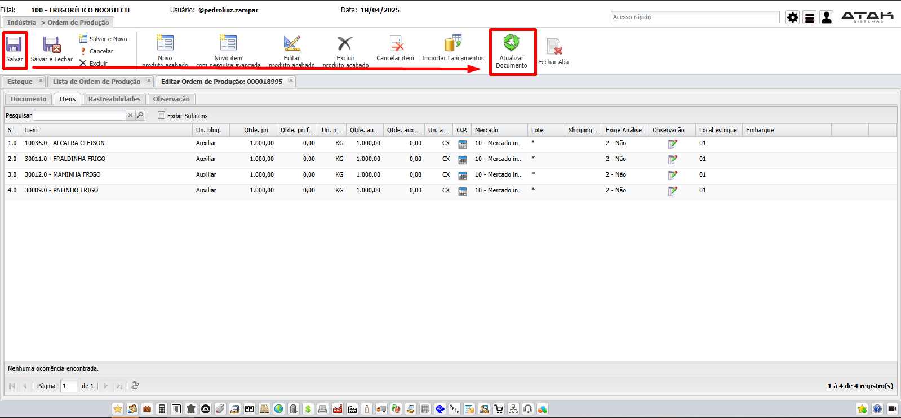
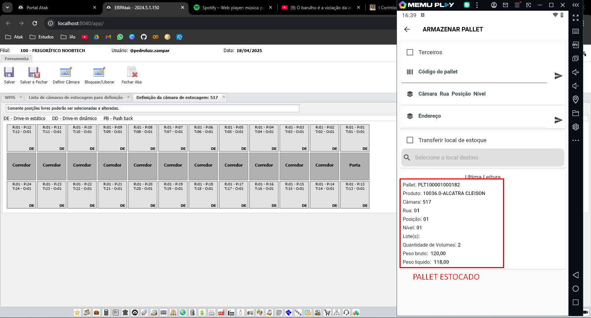
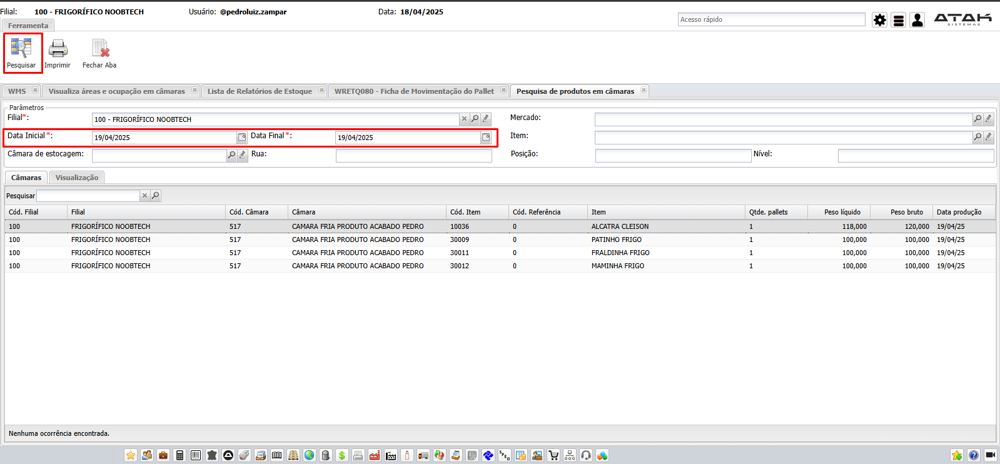

# 📌 **Diário de Bordo 14/03/2025**
## *Treinamento do Frigosoft | Instrutor: Ayad Paracat*

## Ordem de Produção - Produto Acabado (`Indústria -> Ordem de Produção - Produto Acabado`) | Quartos

## Previsão de Matéria-Prima (`Indústria -> Previsão - Matéria Prima`)

## Romaneio de Saída RPS (`Coletor`)
> ### É O PROCESSO DE SAÍDA DO QUARTO DO TRASEIRO E A GERAÇÃO DE ESTOQUE DOS CORTES DE CARNE (PICANHA, CONTRA-FILÉ)

## Apontamento de Produto Acabado

## Palletização de Produtos Acabados

## Armazenar Pallet

## Retirar Pallet

## Retirada Parcial de Pallet

## Câmara de Estocagem (DEFINIÇÃO DA CÂMARA) | `WMS -> Definição de Câmara`

## Relatório

- ### WRPRD004 - Relatório de abate / produção (`Frigorífico -> Relatórios`)
    

- ### WRETQ080 - Ficha de Movimentação de Pallet (`Estoque -> Relatórios`)
    

- ### Pesquisa de Produtos em Câmaras (`WMS -> Pesquisa de Câmara/Produto`)
    