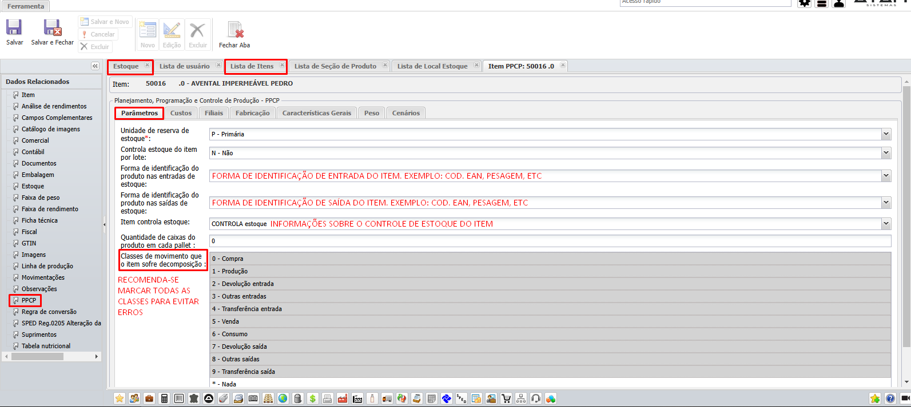
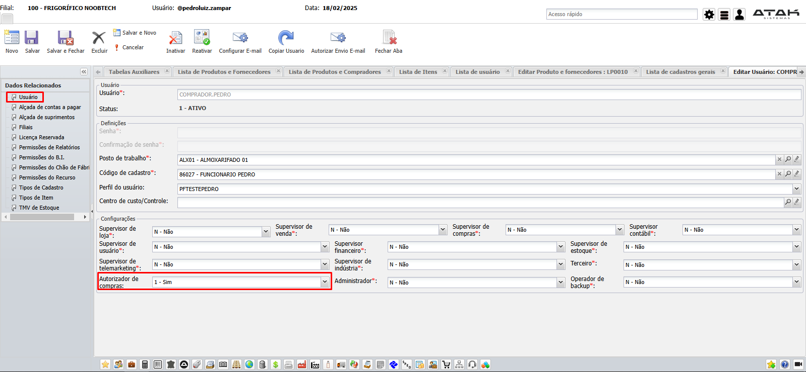
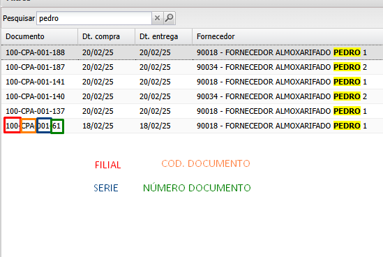
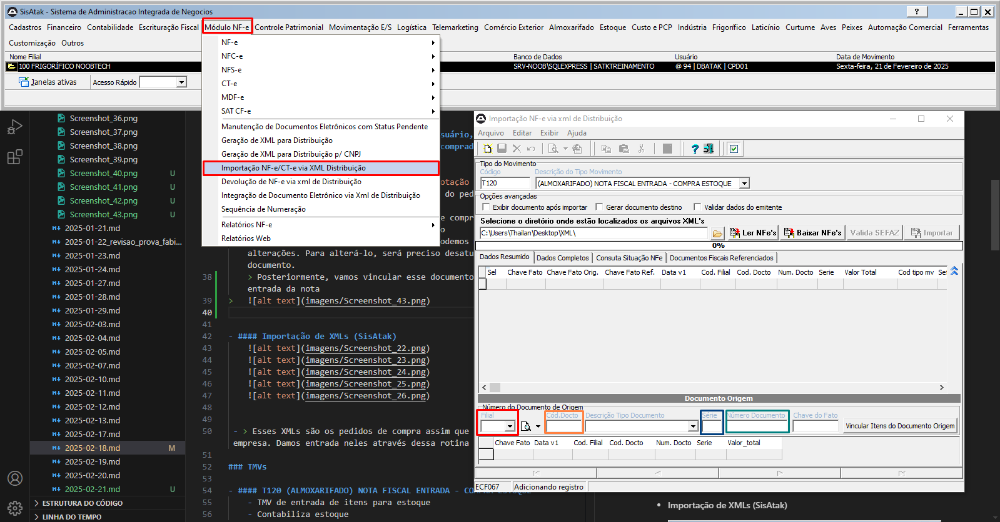
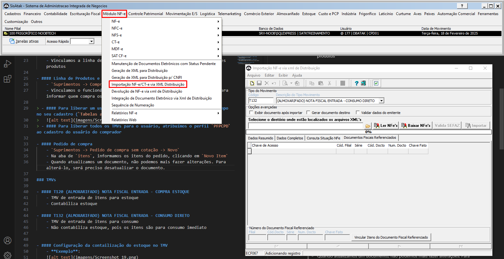
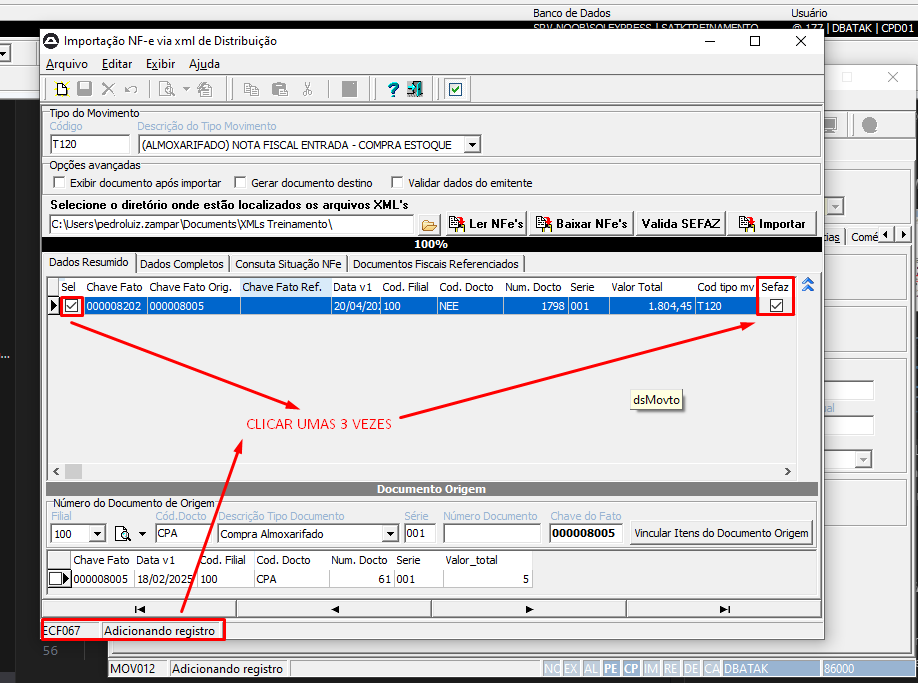
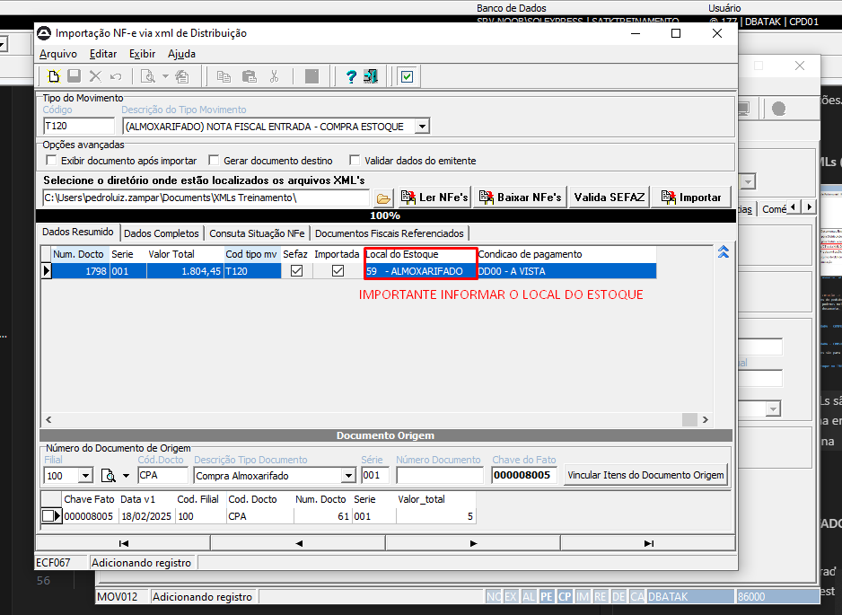
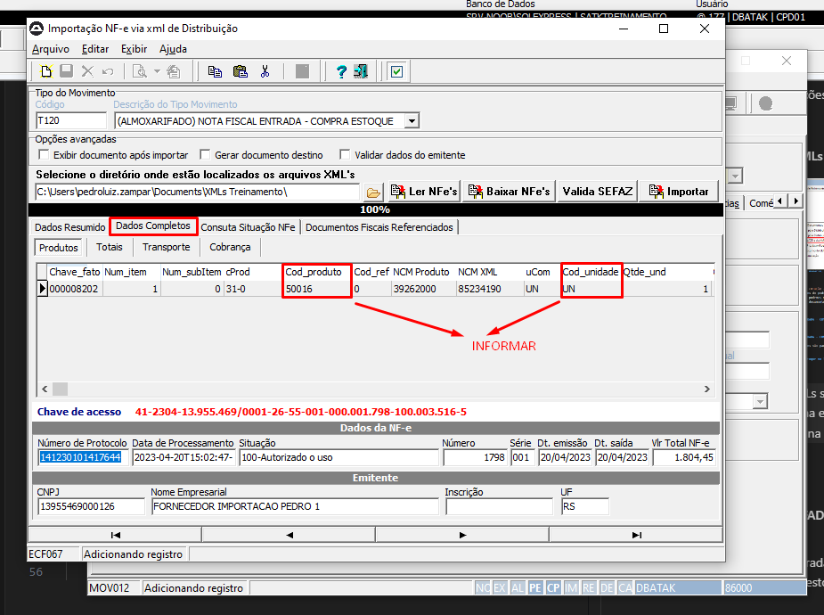
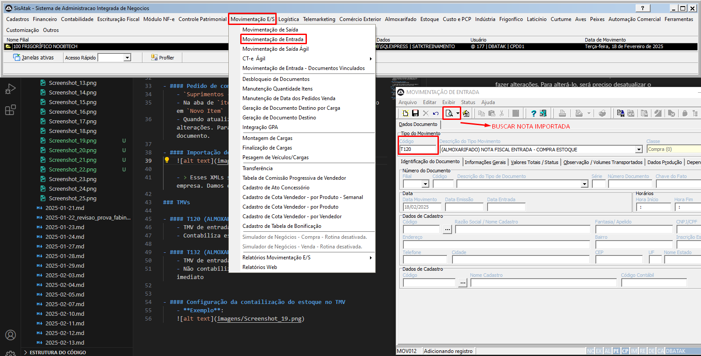
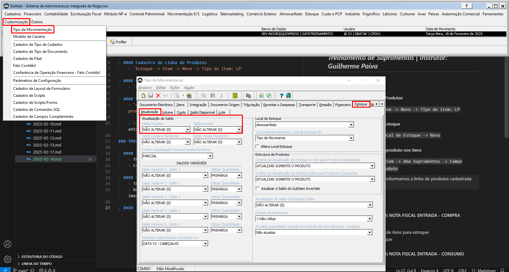

# 📌 **Diário de Bordo 18/02/2025**
## *Treinamento de Suprimentos | Instrutor: Guilherme Paiva*

### Atividades

- #### Cadastro de Linha de Produtos
    - `Estoque -> Item -> Novo -> Tipo do item: LP`

- #### Cadastro de Local de Estoque
    - `Estoque -> Local de Estoque -> Novo`

- #### Vinculando família de produto nos itens
    - `Cadastro do Item -> Aba Suprimentos -> Campo Família do produto`
    
    - > Nesse campo informamos a linha de produtos cadastrada anteriormente

- #### Configurações de estoque no item
    - `Cadastro do Item -> Aba PPCP`
    

- #### Linha de Produtos e Fornecedores
    - `Suprimentos -> Fornecedores Família Produtos -> Novo`
    - Vinculamos a linha de produto criada aos fornecedores que fornecem esses produtos

- #### Linha de Produtos e Compradores
    - `Suprimentos -> Compradores Família Produtos -> Novo`
    - Vinculamos o funcionário do tipo **Comprador** às linhas de produto, para informar quem compra os itens daquela linha

> - #### Para liberar um usuário para compra de itens, é preciso marcar um campo no seu cadastro (`Tabelas auxiliares -> Usuários -> Cadastro do comprador`)
>   
> - #### Para liberar todos os TMVs para o usuário, atribuímos o perfil `PFPCPD` ao cadastro do usuário do comprador

- #### Pedido de compra
    - `Suprimentos -> Pedido de compra sem cotação -> Novo`
    - Na aba de `itens`, informamos os itens do pedido, clicando em `Novo Item`
    - Informamos o TMV T102 para uma ordem de compra ou o TMV T105 para uma ordem de compra sem cotação
    - Quando atualizamos um documento, não podemos mais fazer alterações. Para alterá-lo, será preciso desatualizar o documento.
    > Posteriormente, vamos vincular esse documento lá na entrada da nota
>   
>   
>   

---

- ### Importação de XMLs (SisAtak)
    
    
    
    
    

 - > Esses XMLs são os pedidos de compra assim que chegam na empresa. Damos entrada neles através dessa rotina

### TMVs

- #### T120 (ALMOXARIFADO) NOTA FISCAL ENTRADA - COMPRA ESTOQUE
    - TMV de entrada de itens para estoque
    - Contabiliza estoque

- #### T132 (ALMOXARIFADO) NOTA FISCAL ENTRADA - CONSUMO DIRETO
    - TMV de entrada de itens para consumo
    - Não contabiliza estoque, pois os itens são para consumo imediato

- #### Configuração da contabilização do estoque no TMV
    - **Exemplo**:
    