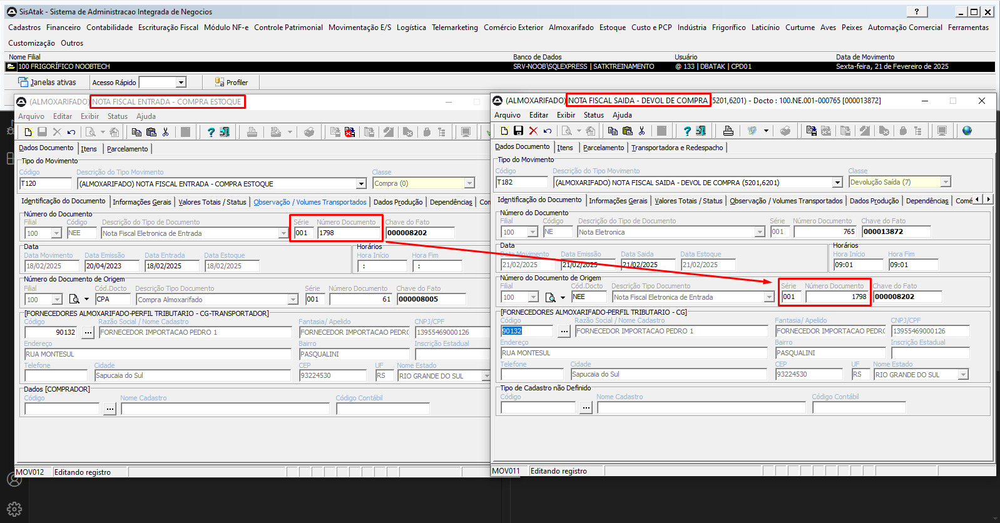
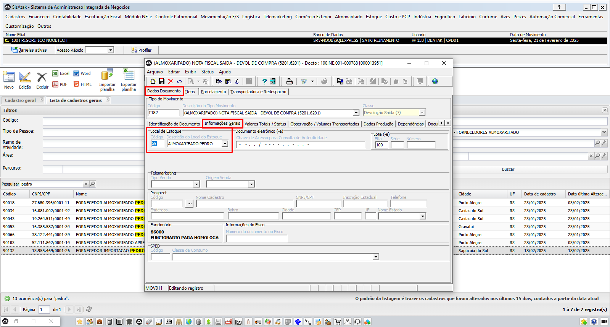
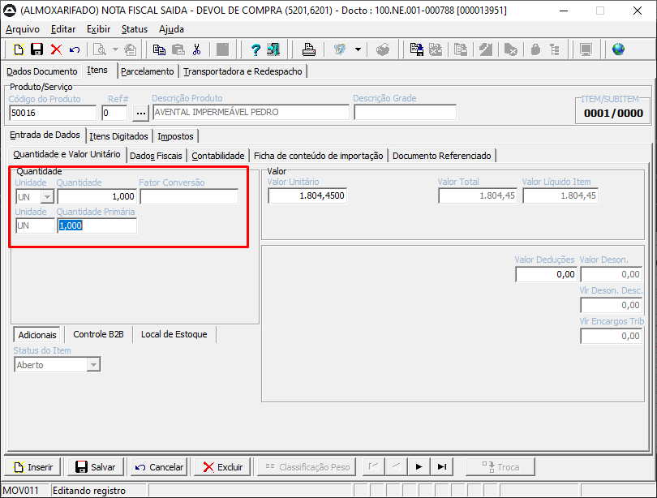

# 📌 **Diário de Bordo 21/02/2025**
## *Treinamento de Suprimentos | Instrutor: Guilherme Paiva*

### Atividades

### Devolução de Pedidos de Compra
- #### TMV T185 - Nota Fiscal de Saída - Devolução Consumo direto (Não contabiliza estoque)
- #### TMV T182 - Nota Fiscal de Saída - Devolução de Compra (Contabiliza estoque)
1. #### Na nota de saída (devolução), devemos informar a série e o documento da nota de entrada que está sendo feita a devolução
    
    
2. ##### É importante verificar o local de estoque para não dar baixa em um estoque errado
    
    
3. #### Além disso, precisamos informar a quantidade de itens devolvidos
    

4. #### Depois e só atualizar o documento

### Relatórios vistos
- `Movimentação E/S -> Relatórios`
    - WRMVS011 - Movimentos de Saída por Documento

- `Suprimetos -> Relatórios`
    - WRSUP001 - Lista de Compradores
    - WRSUP002 - Lista de Fornecedores
    - WRSUP003 - Sugestão de Compra
    - WRSUP004 - Solicitação de Compra
    - WRSUP005 - Cotação
    - WRSUP006 - Orçamento
    - WRSUP007 - Análise de Orçamentos
    - WRSUP008 - Entregas em Atraso
    - WRSUP009 - Previsão de Entrega
    - WRSUP010 - Conferência de Carga x Lançamentos de Notas de Entrada
    - WRSUP011 - Acompanhamento de Compra
    - WRSUP012 - Solicitação de Material
    - WRSUP013 - Gastos por Centro de Custo/Controle
    - WRSUP014 - Gastos por Conta Contábil
    - WRSUP015 - Gastos por Centro de Custo/Controle Conta Contábil
    - WRSUP016 - Ficha de Histórico de Produto
    - WRSUP017 - Histórico de Fornecedor
    - WRSUP018 - Sugestão de Compras

### Parâmetros no módulo de suprimentos
- `Customização -> Suprimentos`

> ## Estoque online busca a informação na tabela tbProdutoSaldo, que movimenta estoque apenas para entrada e saída de notas