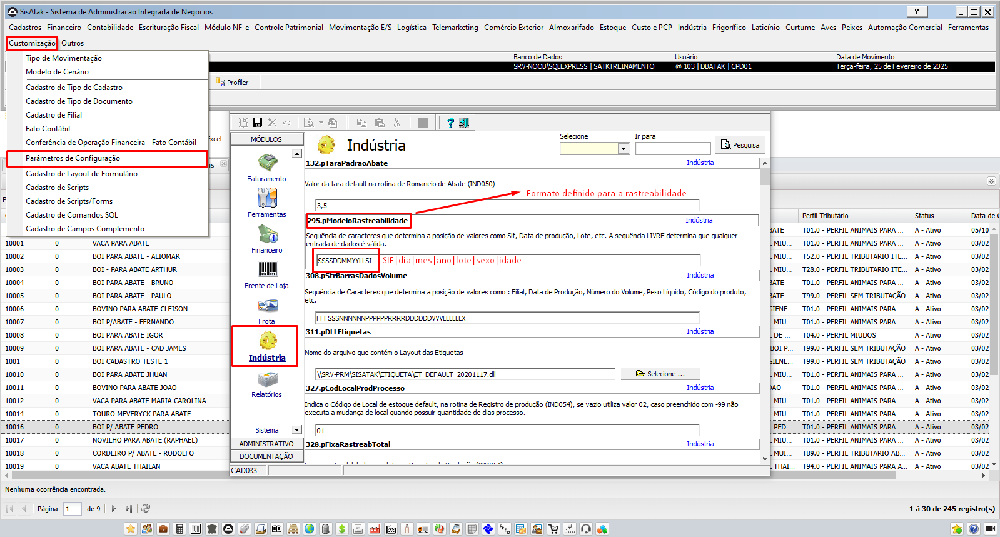

# 📌 **Diário de Bordo 25/02/2025**
## *Treinamento de Suprimentos | Instrutor: Guilherme Paiva*

## Compra de Terceiros

> Compra de terceiros: compra de matéria-prima

### Cadastros
- Cadastro do produto
    - #### Menu Item
        - Tipo do produto: Matéria-Prima
        - Unidades
        - 
    - #### Menu Embalagens
        - Layout de Compra
        - SIF/DIPOA
        - Origem tara externa
        - Peso tara externa (se necessário)
        - Origem taxa interna
        - Peso tara interna (se necessário)
        - Quantidade por caixa/saco
        - Unidades por embalagem
        - Prazo validade
        - Tipo animal
        - Sexo
        - Tipo de temperatura
        - Comestível
        - Peso líquido padrão
        - Peso bruto padrão
        - Peso mínimo
        - Peso máximo
    - #### Menu SIF/DIPOA
        - Campo SIF/DIPOA a nível de filial
    - #### Menu Nomenclatura Internacional
        - Campos "Língua" serão concatenados aos nomes dos produtos nas etiquetas
    - #### Menu PPCP
        - ##### Aba Parâmetros
            - Unidade de reserva de estoque
            - Forma de identificação do produto nas entradas de estoque
            - Forma de identificação do produto nas saídas de estoque
        - ##### Aba Fabricação
            - Mercado
        - #### Aba Características Gerais
            - Exportável
            - Duas pesagens para cada animal
            - Classifica por faixa de peso
            - Rastreado
            - Pesável
        - #### Aba Cenários
            - Cenário 1
            - Cenário 2
            - Cenário 3

### Compra de Carne com Osso de Terceiros

> - #### Se atentar ao centro de custo
---

> - #### Depois de atualizar o documento é que podemos fazer essa visualização

### Romaneio de Entrada

### Faturamento de Entrada

### Controle de Estoque (Carne com Osso)

### Conferência de Relatórios

> ## Configurações das informações das etiquetas da Indústria
> 
> 