# 📌 **Diário de Bordo 27/02/2025**
## *Treinamento de Suprimentos | Instrutor: Guilherme Paiva*

## Devolução de Compra

### 1. Autorização
- ##### TMV 270 - (MATÉRIA-PRIMA) AUTORIZAÇÃO DEVOLUÇÃO DE COMPRA
    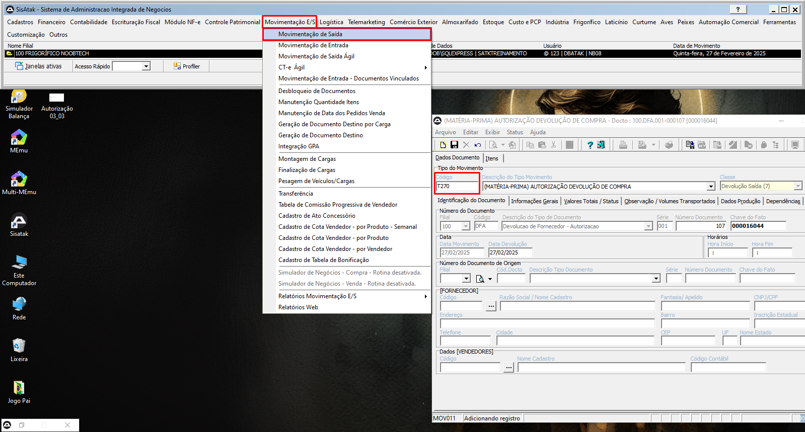
    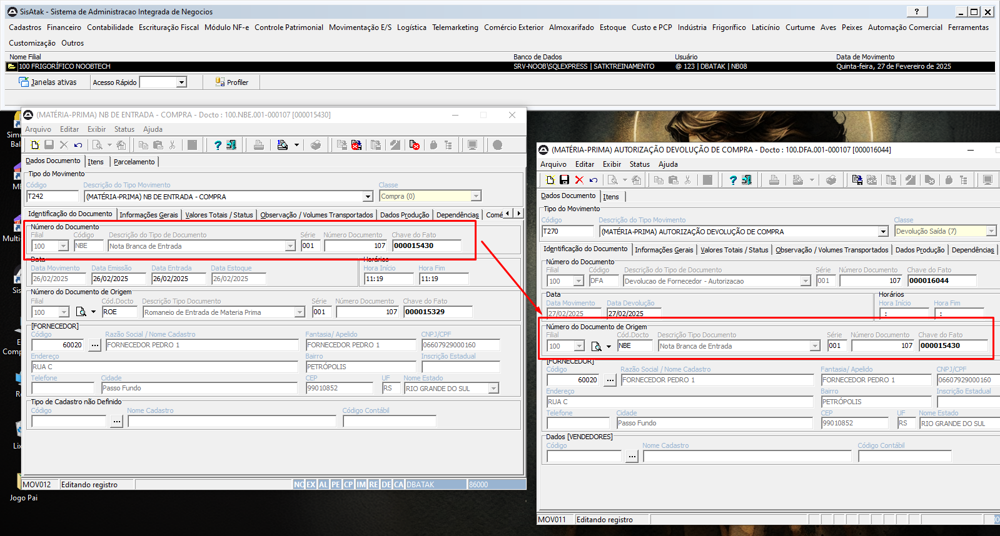

### 2. Romaneio
- #### Pelo SisAtak
    - ##### TMV 271 - (MATÉRIA-PRIMA) ROMANEIO DE DEVOLUÇÃO COMPRA
        > - Mesmo número de documento da autorização.
        > - Qtde. prevista e Qtde. realizada só bloqueiam o movimento quando a **UNIDADE AUXILIAR** é ultrapassada.
        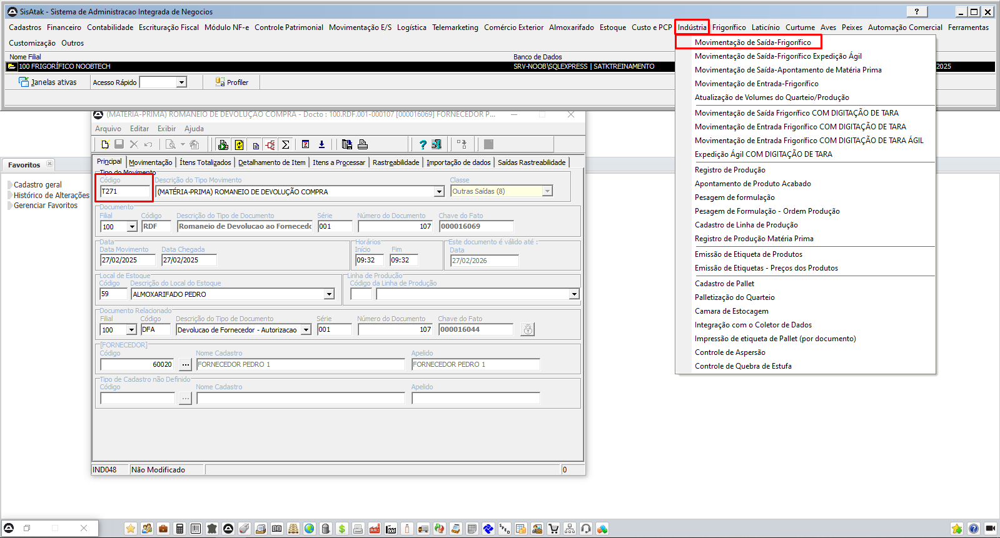
        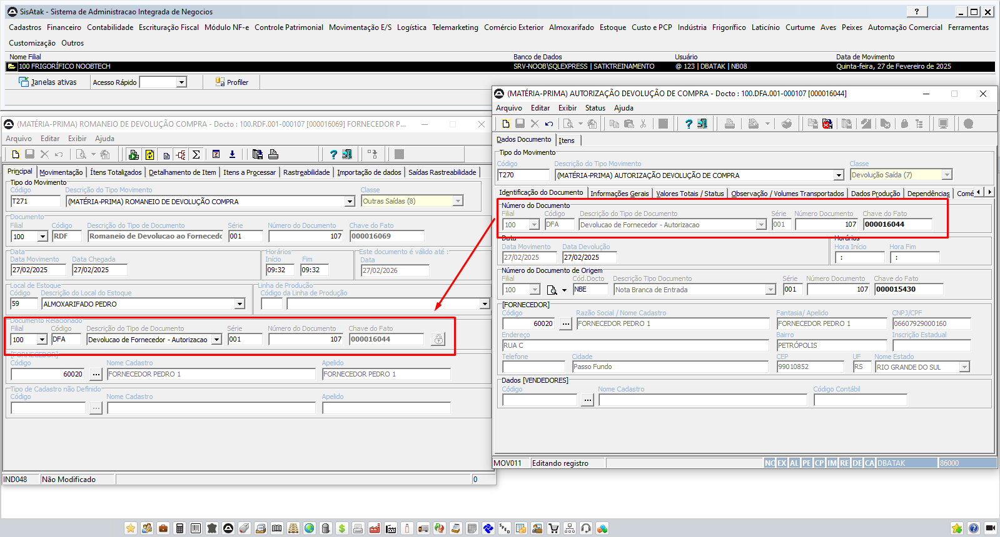

        > ### PARA FAZER A DEVOLUÇÃO DOS ITENS, PRECISAMOS IR INFORMANDO O VOLUME. PARA CONSULTÁ-LO, ACESSAMOS O ROMANEIO DE ENTRADA, (`INDÚSTRIA -> MOVIMENTAÇÃO DE ENTRADA FRIGORÍFICO -> ITENS TOTALIZADOS -> CLICAR SOBRE O ITEM DESEJADO -> DETALHAMENTO DE ITEM`).

        > ## O VOLUME É COMPOSTO POR:
        > - **FILIAL**: 3 DÍGITOS
        > - **SÉRIE**: 3 DÍGITOS
        > - **NÚMERO**: 6 DÍGITOS
        > ##### Ex: 100001000814

        > ### O romaneio de devolução não terá rastreabilidade

        > ### DEPOIS DE FEITO, PRECISAMOS ATUALIZAR O DOCUMENTO ABRINDO O TMV NA TELA MOV011

- #### Pelo Frigosoft
    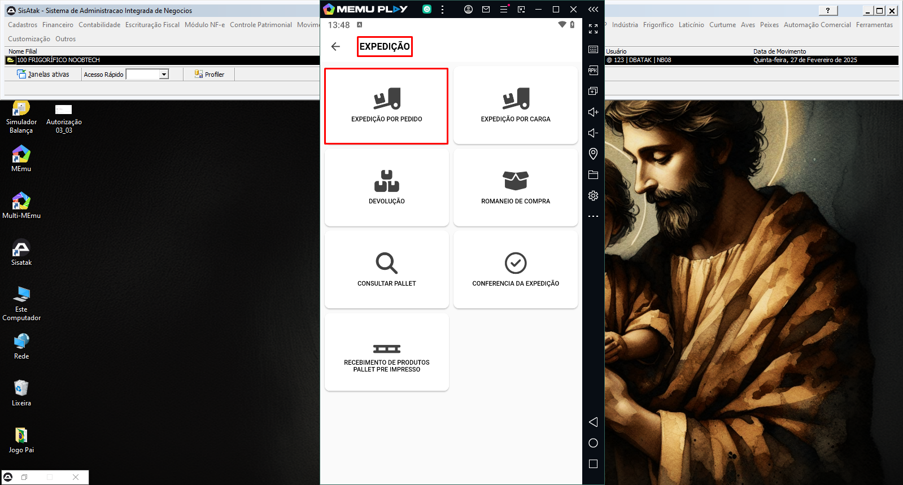
    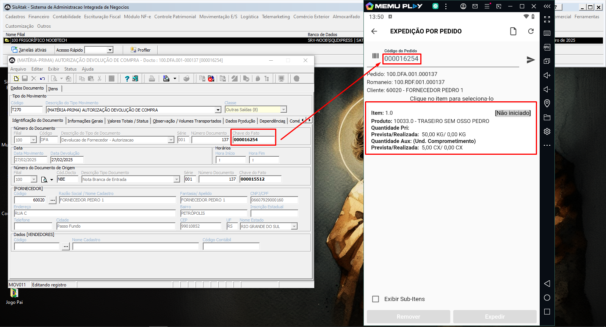
    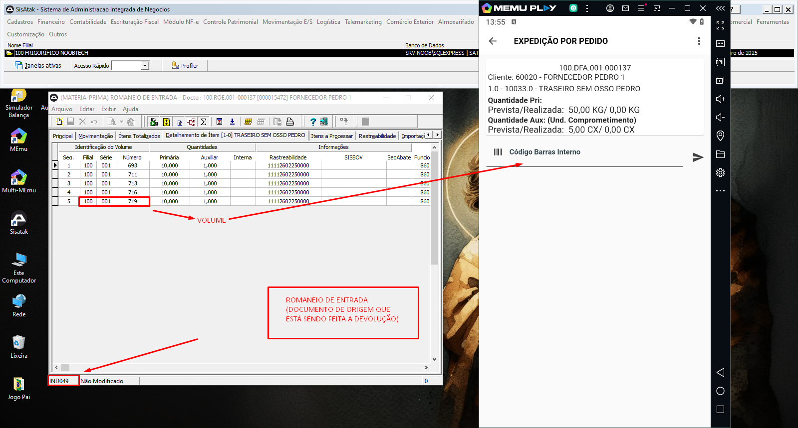

    - #### **Atualizando Romaneio**
        > É preciso voltar uma tela para poder atualizar o documento

        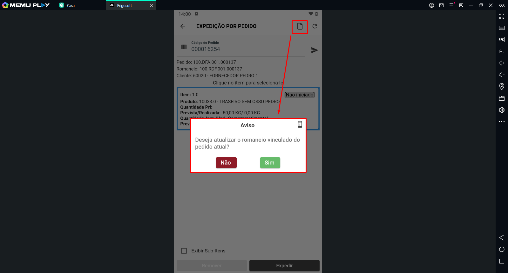

### 3. Nota de Devolução
- ##### TMV 272 (MATÉRIA-PRIMA) NOTA FISCAL SAIDA - DEVOL DE COMPRA (5201,6201)
    > #### Fizemos Nota Branca ao invés da Nota Fiscal

- ##### TMV 286 (MATÉRIA-PRIMA) NB DE SAIDA - DEVOL DE COMPRA
    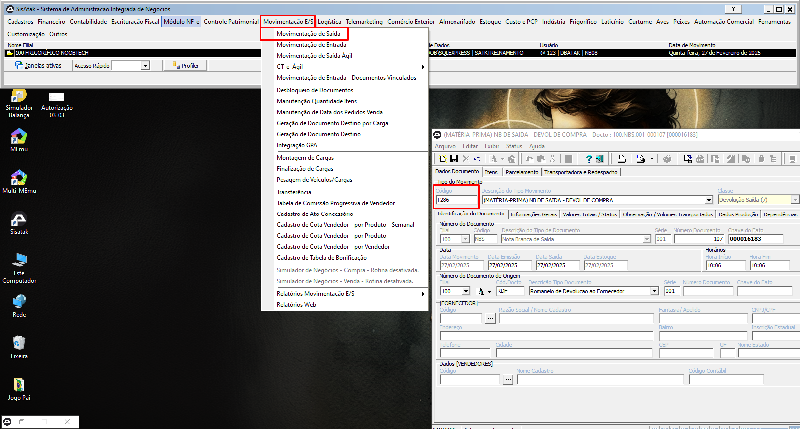
    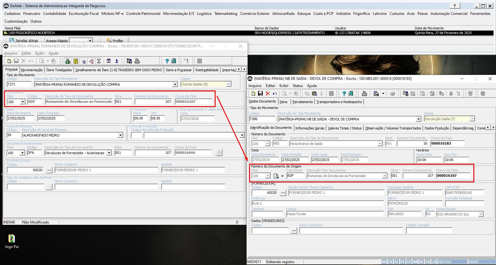

## Relatórios
- `Movimentação E/S -> Relatórios`
- #### WRMVS013 - Movimentos de saída por cadastro
    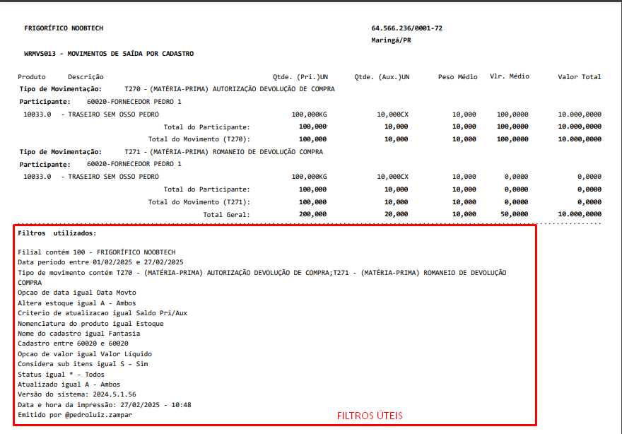

- #### WRMVS011 - Movimentos de saída por documento
    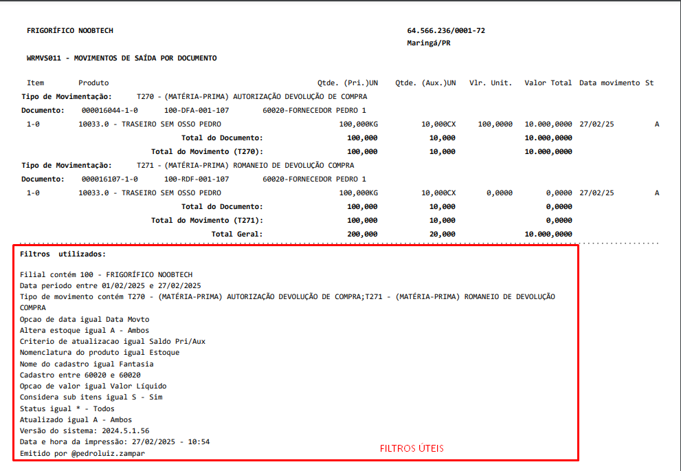

---

> ## Volume: FILIAL|SÉRIE|NÚMERO
> #### Ex: 100001563

> ## Status de Volumes
>   - **E** - Estoque (Ex: item foi produzido e está armazenado no estoque, disponível)
>   - **B** - Baixado (Ex: venda do item, saída do estoque)
>   - **C** - Cancelado (Ex: cancelamento de etiqueta, por má impressão, erro, etc)
>   - **P** - Processo (Ex: em processo de fabricação, como o charque no varal)

---

## Atividade

### Pedidos
|		307		|
|-------------------------------|
|	1 PEDIDO T230    MOV	|
|	1 ROMANEIO T235   IND	|
|	1 NOTA BRANCA		|
|	1 RELATÓRIO WCPA001	|
|	1RELATÓRIO WRCPA002	|

---

|		407		|
|-------------------------------|
|	1 PEDIDO  MOV		|
|	1 ROMANEIO COLETOR	|
|	1 NOTA BRANCA		|
|	1 RELATÓRIO WCPA001	|
|	1 RELATÓRIO WRCPA002	|
_________________________________
_________________________________
_________________________________
_________________________________
_________________________________
_________________________________
_________________________________
_________________________________

### Devoluções
|		307		|
|-------------------------------|
|	1 PEDIDO T230    MOV	|
|	1 ROMANEIO T235   IND	|
|	1 NOTA BRANCA		|
|	1 RELATÓRIO WRMVS011	|

---

|		407		|
|-------------------------------|
|	1 PEDIDO  MOV		|
|	1 ROMANEIO COLETOR	|
|	1 NOTA BRANCA		|
|	1 RELATÓRIO WRMVS011	|

---

|         |                 |
| -       | -               |
|	QTDE. | PRI = 100		|
|	QTDE. | AUX = 10		|

FILTRANDO OS DOCUMENTOS QUE GEROU 
NAS DEVOLUÇÕES QTDE TOTAL DOS ITENS RECEBIDOS

SALVAR RELATÓRIOS EM 
\172.20.3.124\sisatak\DOCUMENTOS\NOME 